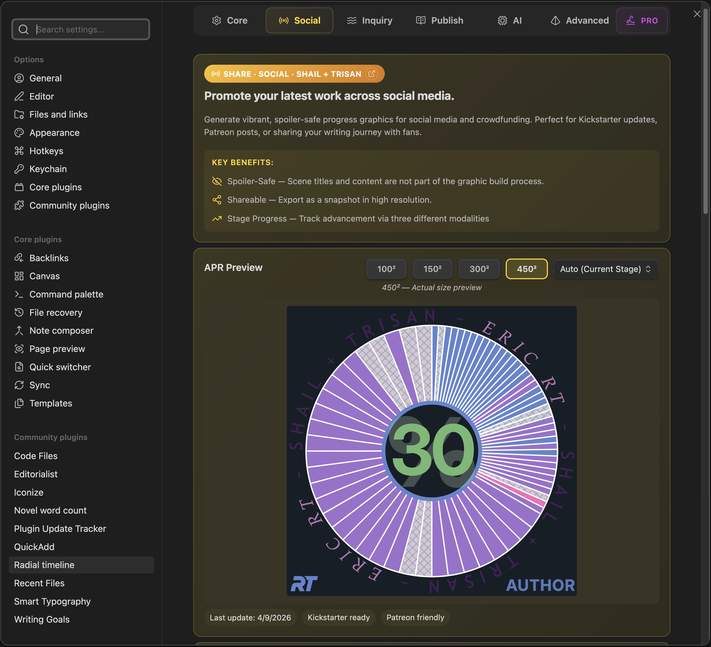
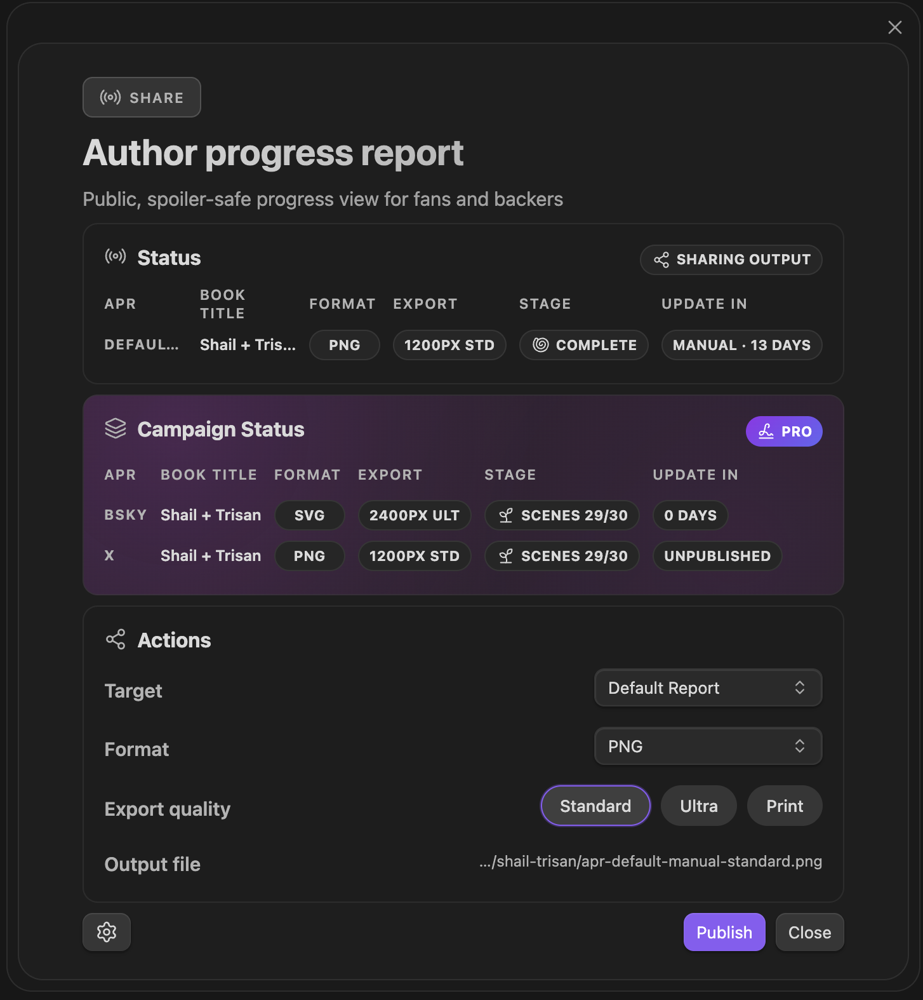

  
  
Settings → Social

The Author Progress Report (APR) creates a spoiler-safe progress graphic for newsletters, social posts, Patreon, and Kickstarter updates.

  
  
Author Progress Report — configure, preview, and export your progress graphic

## Progress Tracking

APR can measure progress in three ways:

| Mode | How It Works | Best Use |
|------|--------------|----------|
| **Stage Tracking** | Tracks one stage at a time against a scene goal. | Zero drafting, focused revision passes, or any stage-specific sprint |
| **Full Manuscript** | Tracks all scenes across Zero → Press. | End-to-end public progress across the full pipeline |
| **Date Goal** | Tracks elapsed time between a start date and a target date. | Deadline-driven campaigns and schedule-based updates |

### Stage Tracking

Stage Tracking focuses on one stage at a time. Choose the tracked stage, then set a scene goal when you want a fixed denominator. This is especially useful in **Zero** when you know the target scene count for the draft and want APR to reflect that specific push.

### Full Manuscript

Full Manuscript measures the book across the full revision path from **Zero** to **Press**. Use it to show overall manuscript progress.

### Date Goal

Date Goal measures progress through a date range. Set a start date and target date, and APR will show how far you have moved through that range.

> **Note**: APR tracking is separate from the timeline's Estimated Completion feature, which projects pace inside the working manuscript view.

## Reveal Options

Control how much of your story structure is visible:

| Option | What It Shows |
|--------|---------------|
| **Subplots** | Multiple concentric rings for each subplot |
| **Acts** | Act boundary spokes dividing the timeline |
| **Status Colors** | Scene stage/status colors (Todo, Draft, Complete, etc.) |
| **% Complete** | Large percentage number in the center |

**Tip**: Uncheck all options for a simple progress ring—perfect for early teasers or minimal updates. Manual reveal options are disabled when Teaser Reveal is enabled.

## Teaser Reveal (Pro)

For campaigns, enable **Teaser Reveal** to automatically show more detail as your book progresses.

Reveal stages:

| Stage | Shows |
|-------|-------|
| Teaser | Progress ring only |
| Scenes | Scene cells (no colors) |
| Colors | Scene cells with status colors |
| Full | Complete timeline with subplots and acts |

Preset schedules:
- **Slow**: 15%, 40%, 70%
- **Standard**: 10%, 30%, 60% (default)
- **Fast**: 5%, 20%, 45%
- **Custom**: Set your own thresholds (1-99%)

You can click the middle stages in the preview (Scenes, Colors) to skip them and jump to the next stage.

## Preview Size

The **Size** selector (Small, Medium, Large) controls the **design intent** of the graphic — which elements are shown and how dense the layout is — not the final export resolution. The dimensions below refer to the in-modal preview only. For a bare progress ring with no text or labels, switch the view mode to **Ring**.

| Size | Preview | Design Intent |
|------|---------|---------------|
| Small | 150×150 px | Compact graphic for inline embeds |
| Medium | 300×300 px | Default — balanced density and labels |
| Large | 450×450 px | Full layout with all reveal elements |

## Export Quality

The exported file is always rendered at one of three pixel sizes, chosen via **Export quality**:

| Quality | Output | File Size | Best For |
|---------|--------|-----------|----------|
| Standard | 1200 px | ~150 KB | Web posts, social media, newsletters |
| Ultra | 2400 px | ~400 KB | Crisp embeds on high-DPI displays |
| Print | 4800 px | ~1.2 MB | Print-quality graphics, large banners |

The combination of **Size** (design intent) and **Export quality** (resolution) determines the final PNG: e.g., Medium + Ultra produces the medium layout rendered at 2400 px.

## Styling Options

- **Transparent Background**: Recommended for embedding on any background
- **Background Color**: Use when transparency isn't supported
- **Theme Contrast**: Light or dark strokes for visibility against your background
- **Book/Author Color**: Color for the perimeter text ring
- **Branding Color**: Color for the "RT" badge

## Export And Refresh

APR exports a static **PNG or SVG** file. The **Output file** row in the panel is clickable and reveals the current export file in your system file manager.

*   **Update frequency**: Manual Only, Daily, Weekly, or Monthly. Manual mode requires clicking the update button in the modal.
*   **Refresh alert threshold**: Days before showing a refresh reminder in the Radial Timeline View.
*   **Output file**: Shows the current export file path for the default report or the selected campaign. Click it to reveal the file.
*   **Auto-update export paths**: When size or schedule changes, updates the default export path if it still matches the default pattern.

## Campaigns (Pro)

Create multiple APR configurations for different platforms:

- **Kickstarter**: 7-day refresh reminders
- **Patreon**: 14-day refresh reminders
- **Newsletter**: 14-day refresh reminders
- **Website**: 30-day refresh reminders

Each campaign can have its own update frequency, refresh alert threshold, output file, export size, and reveal settings. Teaser Reveal can be enabled per campaign, and manual reveal options are available when Teaser Reveal is disabled.

### Send A Campaign To Community

Community sharing is available when this vault is connected and **Profile, books + progress report** (Level 2) or **Profile, books + writing activity** (Level 3) is selected in Community settings.

For each campaign:

1. Choose the campaign's target book.
2. Enable **Send to Community**.
3. Click **Send now** to upload the current APR directly to your private My Share area, or use the campaign's Daily, Weekly, or Monthly update frequency.
4. Review the exact image on **My Share**, then activate it when you are ready. Its book must be public first.

The local **Update** action still creates the campaign's PNG or SVG export. **Send now** renders and uploads without requiring a separate local export. A scheduled campaign can do both when it becomes due.

Community uploads always land privately first. Level 2 permits the visual APR but does not share writing-day, streak, minutes, inactivity, or session statistics. Level 3 is the separate opt-in for broader writing activity.

Campaign schedules run while the plugin is open. Due campaigns are checked on plugin startup and hourly while the vault is open. If an update is missed while Obsidian is closed, it runs on the next startup.
