Radial Timeline provides commands through the Obsidian Command Palette.

To open the Command Palette:
*   **Mac**: `Cmd + P`
*   **Windows/Linux**: `Ctrl + P`

Type `Radial timeline` to filter the list.

  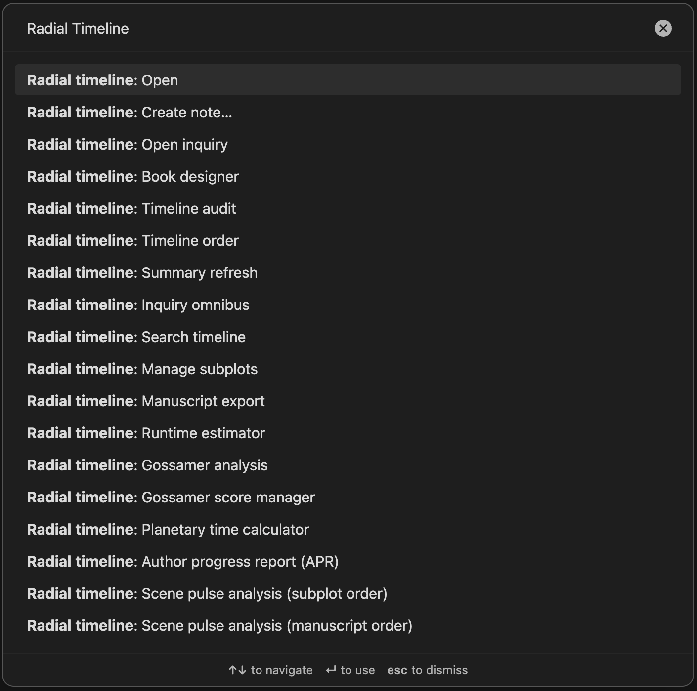
  
Radial Timeline Commands in the palette

## Command Index

These are the main command-palette entries.

1. **Open** — opens the [Radial Timeline View](Radial-Timeline-View).
2. **[Create note…](#create-note)**
3. **Open inquiry** — opens the [Inquiry View](Inquiry).
4. **[Book designer](Book-Designer)** ← standalone guide
5. **[Onboard manuscript](#onboard-manuscript)** *(beta)*
6. **[Timeline order](#timeline-order)** *(beta)*
7. **[Timeline audit](#timeline-audit)** *(beta)*
8. **[Manage subplots](#manage-subplots)**
9. **[Summary refresh](#summary-refresh)**
10. **[Search timeline](#search-timeline)**
11. **[Gossamer analysis](#gossamer-analysis)**
12. **[Runtime estimator](#runtime-estimator)** *(Pro)*
13. **[Manuscript export](Manuscript-Export)** ← standalone guide
14. **[Inquiry omnibus](#inquiry-omnibus-pass)** *(beta)*
15. **[Gossamer score manager](#gossamer-score-manager)**
16. **[Planetary time calculator](#planetary-time-calculator)**
17. **[Author progress report (APR)](Author-Progress-Report)** ← standalone guide
18. **[Scene pulse analysis (subplot order)](#scene-pulse-analysis-subplot-order)**
19. **[Scene pulse analysis (manuscript order)](#scene-pulse-analysis-manuscript-order)**

## Conditional Visibility

Some commands are hidden until their required feature is enabled. Others remain visible but stop with a setup message if prerequisites are missing:

*   **Scene pulse analysis** and **Summary refresh** appear only when **AI LLM features** are enabled in [Settings → AI](Settings-AI).
*   **Open inquiry** stays listed either way, but the same AI-enabled gate applies: enable AI in Settings → AI to open the view and show its ribbon icon.
*   **Gossamer analysis** is visible, but the run requires an active beat system, story beats, scene content, and usable AI settings.
*   **Runtime estimator** is a **Pro** workflow. Runtime configuration lives in [Settings → Core](Settings-Core#runtime-estimation).
*   **Planetary time calculator** is visible, but it needs at least one configured planetary profile before it can produce a conversion.
*   **Timeline order** and **Timeline audit** show a release-pending notice in public release builds and are usable in development/testing builds.
*   **Inquiry omnibus** appears only in development/testing builds.
*   **Onboard existing manuscript (BETA)** appears in development/testing builds. Choose structure-only import or Local LLM assistance.

---

## Create note…

Opens the guided RT note selector.

  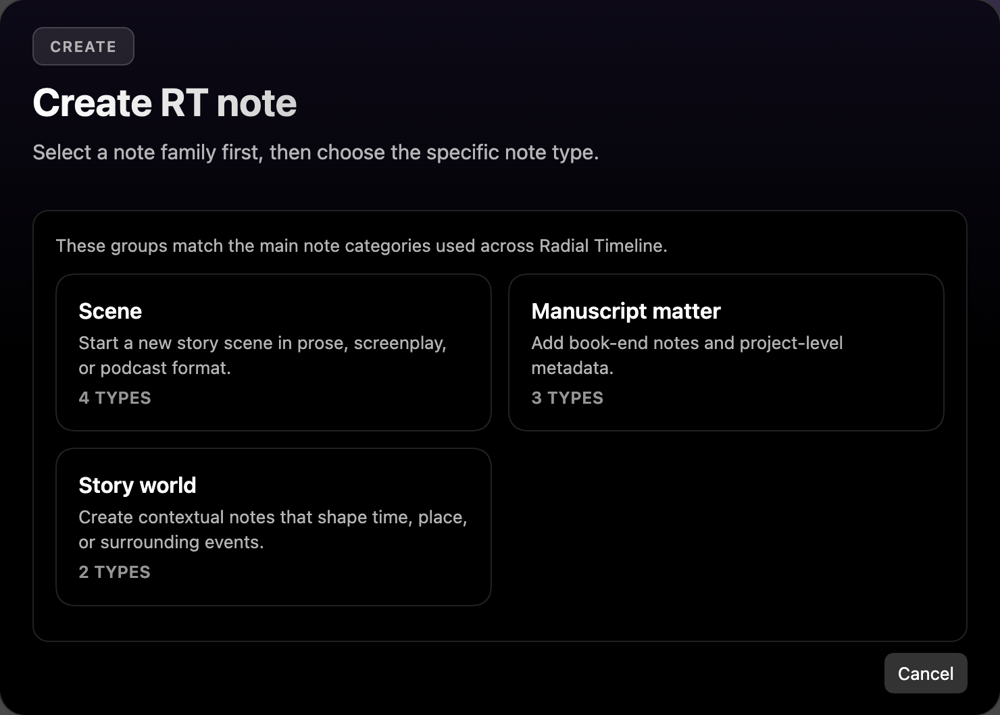

The selector is organized into three families:

*   **Scene** — Core scene, scene with advanced properties, screenplay scene, podcast scene.
*   **Manuscript matter** — Front matter, back matter, `BookMeta`.
*   **Story world** — Beat and Backdrop.

After you choose a subtype, the file is created in the active book folder and opened immediately. Scene creation includes built-in scaffolds: minimal properties for basic scenes, richer metadata for advanced scenes, screenplay/podcast body scaffolds plus runtime defaults for those types.

Related: [Scene Properties (Core + Advanced)](YAML-Frontmatter).

---

## Onboard manuscript *(beta)*

Opens the guided onboarding flow for importing an existing manuscript.

> [!NOTE]
> Currently undergoing beta testing. Available only in development/testing builds for now. Choose structure-only import or Local LLM assistance — see [Settings → AI → Local LLM](Settings-AI#local-llm) for setup and the hardware guidance in [Onboarding And Local Model Hardware](Settings-AI#onboarding-and-local-model-hardware).

Walks a book folder through a four-stage sequence — preparing and reading the source text, proposing scene splits for confirmation, generating scene profiles (characters, places, summaries) for review, and writing the accepted result to the vault. Each stage is reviewable before it commits anything.

Related: [Settings → AI → Local LLM](Settings-AI#local-llm), [Book Designer](Book-Designer).

---

## Timeline order *(beta)*

Opens the timeline order normalizer (Timeline Repair wizard).

> [!NOTE]
> Currently undergoing beta testing. Public release builds show this command as release-pending; development/testing builds can open the workflow.

  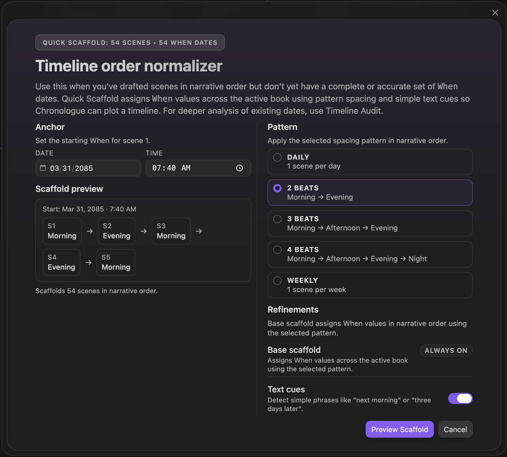

The wizard helps you normalize `When` values in manuscript order, then review the proposed timeline before writing changes back to frontmatter. It supports scaffold-based chronology setup, anchor date and time selection, time-bucket adjustments (morning/afternoon/evening/night), ripple mode for cascading changes, needs-review filtering, and undo/redo before applying.

Use [Timeline audit](#timeline-audit) to review chronology and continuity findings.

Related: [Chronologue Mode](Chronologue-Mode).

---

## Timeline audit *(beta)*

Opens the timeline audit panel.

> [!NOTE]
> Currently undergoing beta testing. Public release builds show this command as release-pending; development/testing builds can open the workflow.

  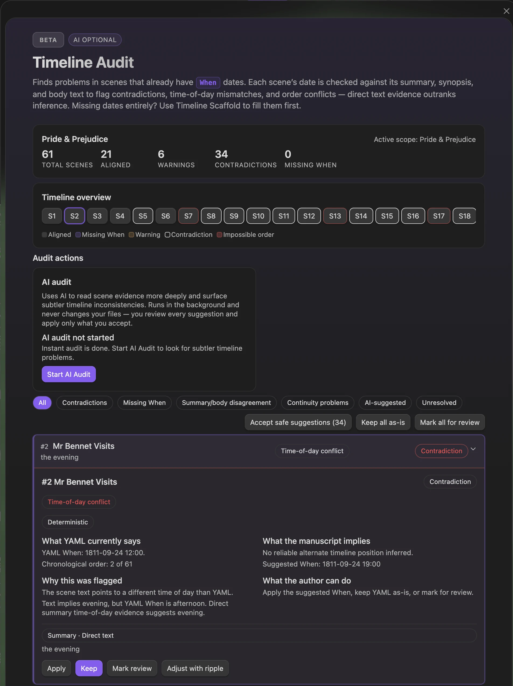

Surfaces contradictions, missing `When` values, summary/body disagreement, continuity problems, and unresolved findings. The panel shows overview stats, finding filters, and finding cards with evidence and suggested actions.

The audit includes a deterministic pass and can optionally run a continuity pass. AI findings appear alongside deterministic findings for review. From the panel you can filter findings by issue type, inspect evidence, mark items for review, apply accepted fixes where supported, and rerun the audit after changes.

Related: [Timeline order](#timeline-order), [Chronologue Mode](Chronologue-Mode).

---

## Manage subplots

Opens the subplot manager for bulk cleanup. Use it when subplot names have drifted.

  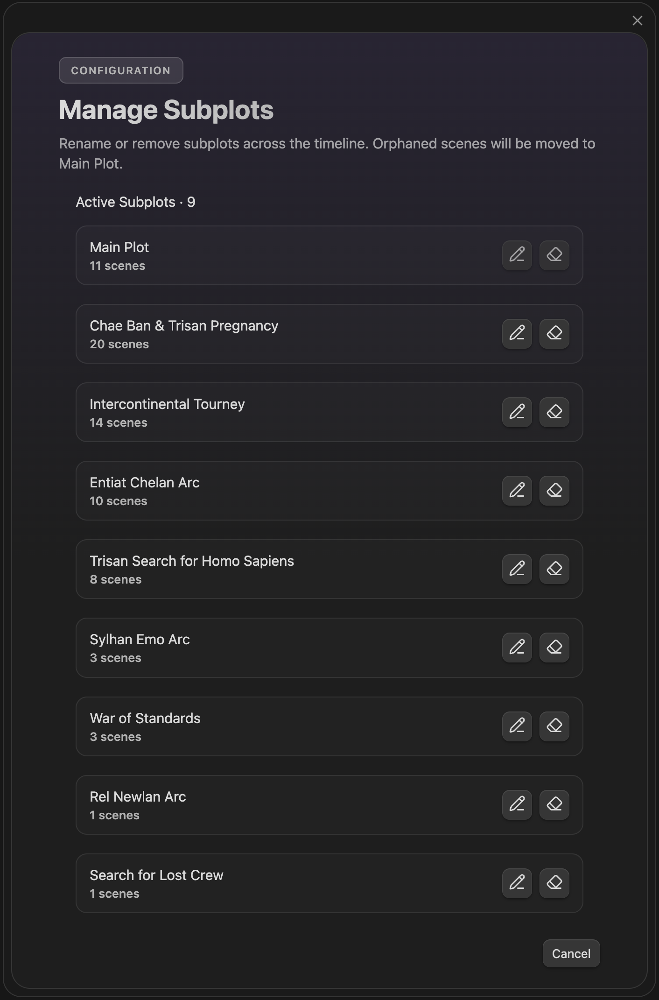

Lists active subplots with scene counts and gives you bulk actions:

*   **Rename** a subplot across scene files.
*   **Remove** a subplot from the timeline.

  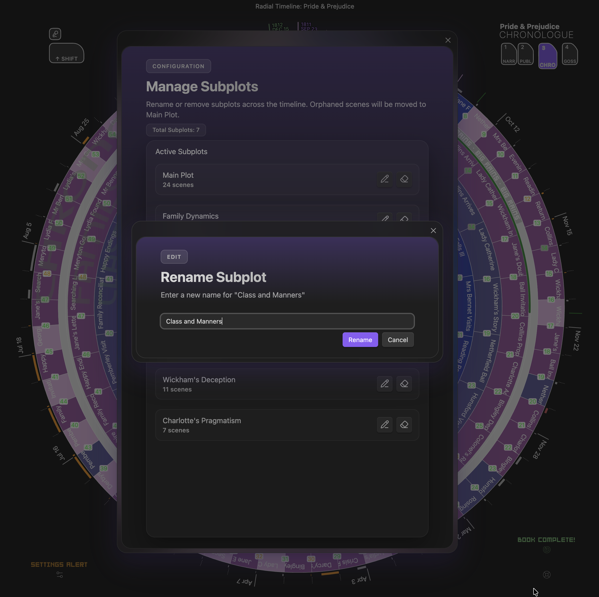
  
Rename a subplot — automatically updates the frontmatter of every scene using it

`Main Plot` is protected and cannot be renamed or deleted. Removing a subplot moves any scenes that only belonged to it back to `Main Plot`.

Related: [Narrative Mode](Narrative-Mode), [How to](How-to#manage-subplots-in-bulk).

---

## Summary refresh

Regenerates scene summaries with AI.

  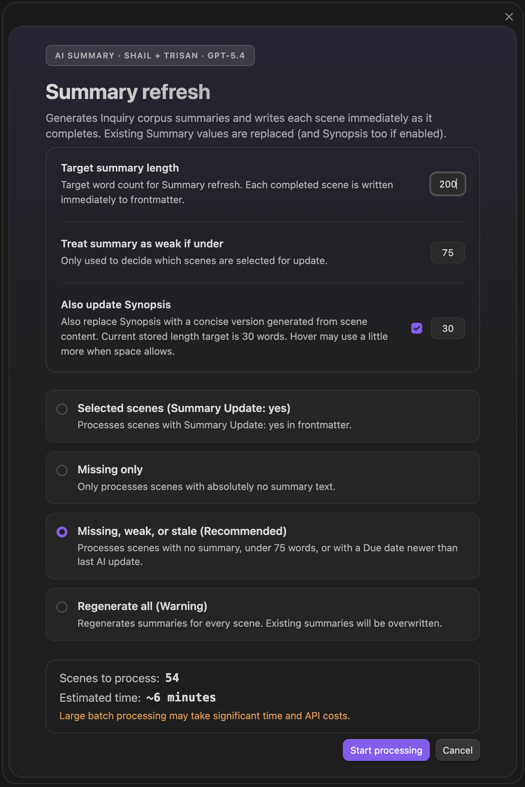

Writes:

*   **Summary** — the longer corpus-oriented summary.
*   **Synopsis** — optional, if you enable `Also update Synopsis`.

Run modes: flagged scenes, missing summaries only, missing/weak/stale, or regenerate all. You can also set target summary length, weak-summary threshold, and optional Synopsis update length.

This command is separate from scene pulse analysis: **Pulse** writes short structured editorial feedback per scene; **Summary refresh** writes longer summary text for corpus-level use.

Related: [AI Pulse Triplet Analysis](AI-Pulse-Analysis), [Inquiry View](Inquiry).

---

## Search timeline

Opens the timeline search bar.

  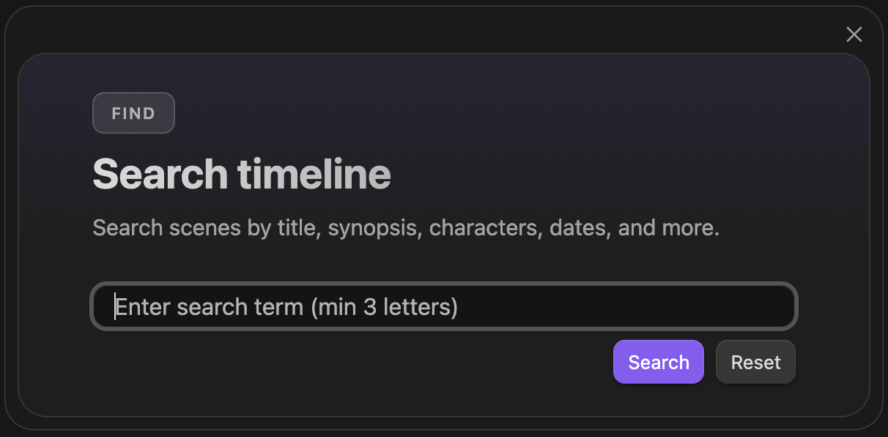

Choose **Timeline fields**, **Scene body**, or both in **Search options**. Press **Enter** for text search, or enable **Local LLM assist** for concept matching with verified evidence quotes. See [Search](How-to#search) for scope, highlighting, and local AI setup.

Related: [How to → Search](How-to#search).

---

## Gossamer analysis

Runs the built-in AI scoring workflow for the active Gossamer signal.

  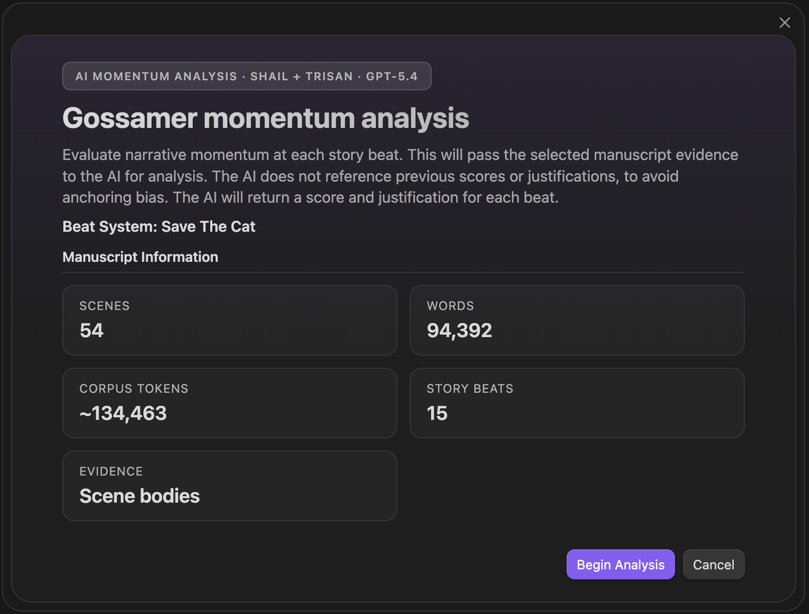

Works against the active beat system and the active signal — Momentum, Tension, Activity, or Interiority. AI scores the supplied manuscript material independently of your visual Momentum ranges.

Related: [Gossamer Mode → AI Analysis](Gossamer-Mode#ai-analysis).

---

## Runtime estimator *(Pro)*

Opens the runtime estimation panel.

  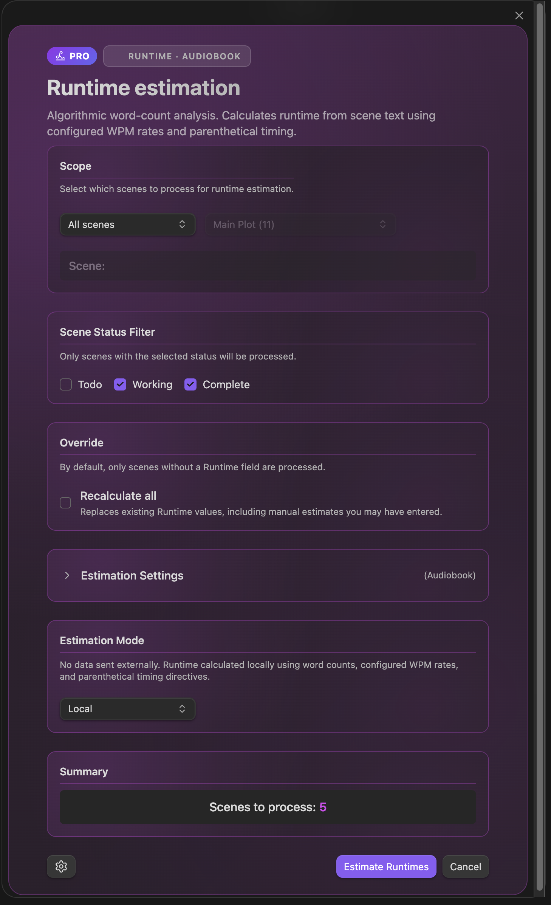

Used for novels, audiobooks, and screenplays. The panel works with runtime profiles and can estimate duration across different scopes and filters. Available only when **Pro** is active.

Related: [Settings → Core → Runtime estimation](Settings-Core#runtime-estimation), [Chronologue Runtime sub-mode](Chronologue-Mode#runtime-sub-mode).

---

## Inquiry omnibus *(beta)*

Runs all enabled Inquiry questions in one batch.

> [!NOTE]
> Currently undergoing beta testing. Available only in development/testing builds for now.

  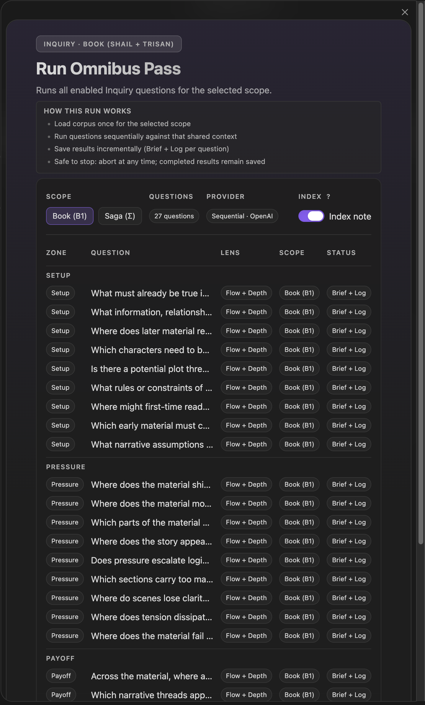

Executes enabled questions across the Inquiry zones and returns a combined set of findings for the current corpus. Works with the active scope (Book or Saga). Depending on provider and engine path, the run may execute as a combined omnibus flow or as sequential provider calls behind the scenes.

Related: [Inquiry View](Inquiry), [Running an Inquiry](Inquiry#running-an-inquiry).

---

## Gossamer score manager

Opens the manual score-entry panel for the active signal.

  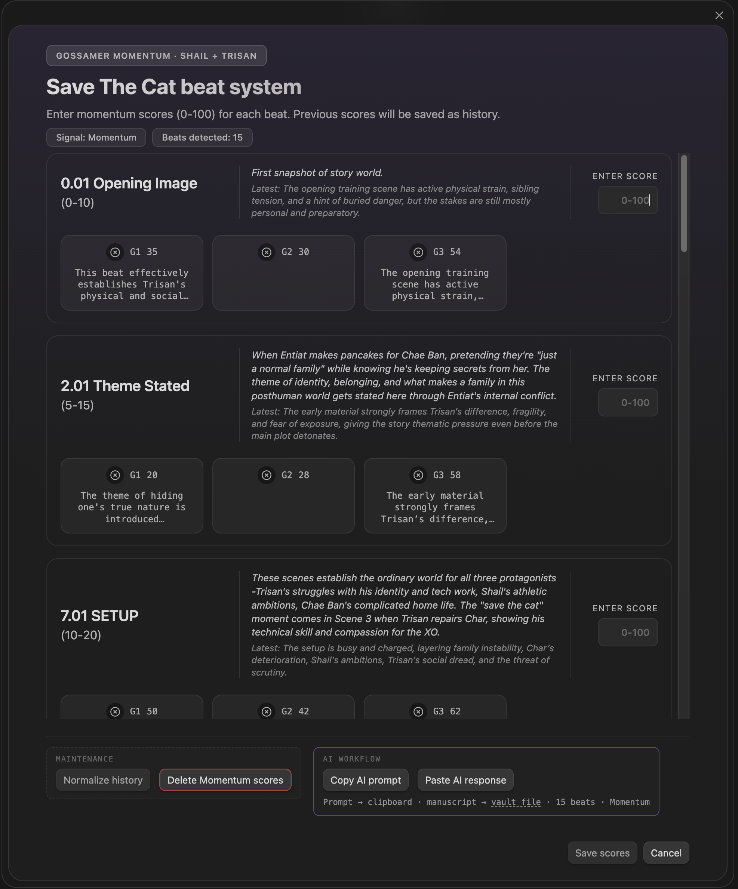

Supports manual score entry, score justifications, run history cleanup and normalization, and working with saved beat runs. Create beat notes for the active beat system before opening the panel.

Related: [Gossamer Mode → Manual Entry](Gossamer-Mode#manual-entry).

---

## Planetary time calculator

Opens the planetary conversion panel.

  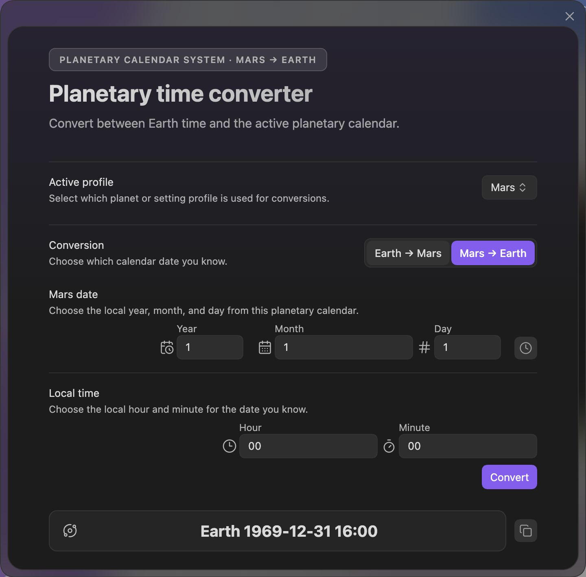

Uses the active planetary profile from [Settings → Core](Settings-Core) and lets you select a date and time, convert that Earth timestamp to local planetary time, and copy a YAML-friendly result block. The refreshed panel is designed for quick Alien Calendar checks while writing. Select an active planetary profile in Settings → Core before converting dates.

Related: [Planetary Calendar](Chronologue-Mode#alt-sub-mode).

---

## Scene pulse analysis (subplot order)

Opens the subplot pulse selector first, then runs pulse analysis for a selected subplot.

  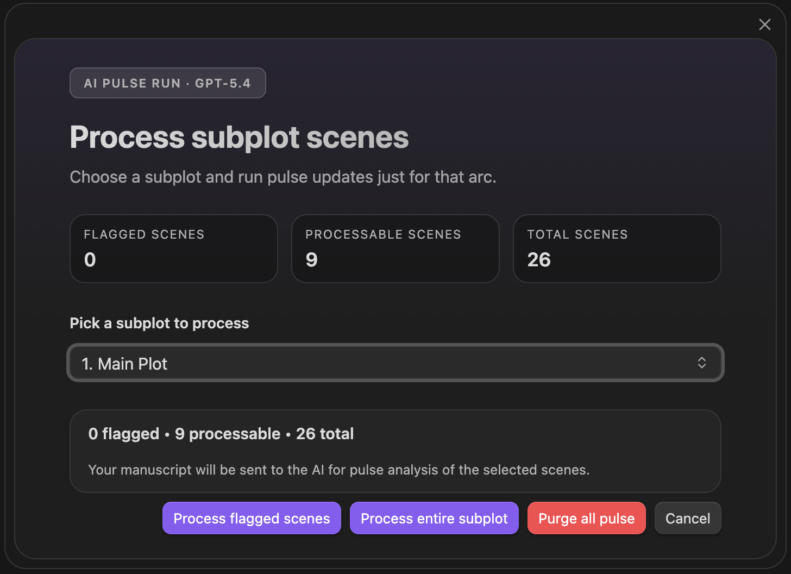

The subplot selector shows flagged scenes, processable scenes, and total scenes. From there you can choose **Process flagged scenes**, **Process entire subplot**, or **Purge all pulse** for that subplot.

Related: [AI Pulse Triplet Analysis](AI-Pulse-Analysis), [Manage subplots](#manage-subplots).

---

## Scene pulse analysis (manuscript order)

Opens the pulse command panel for manuscript-order analysis.

  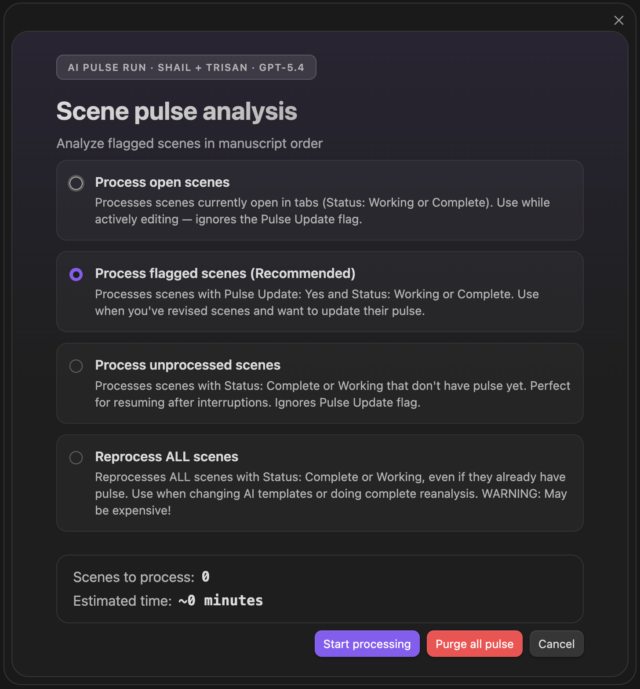

Run modes: process open scenes, process flagged scenes, process unprocessed scenes, or reprocess all scenes.

Related: [AI Pulse Triplet Analysis](AI-Pulse-Analysis), [Summary refresh](#summary-refresh).
