Radial Timeline provides commands through the Obsidian Command Palette.

To open the Command Palette:
*   **Mac**: `Cmd + P`
*   **Windows/Linux**: `Ctrl + P`

Type `Radial timeline` to filter the list.

  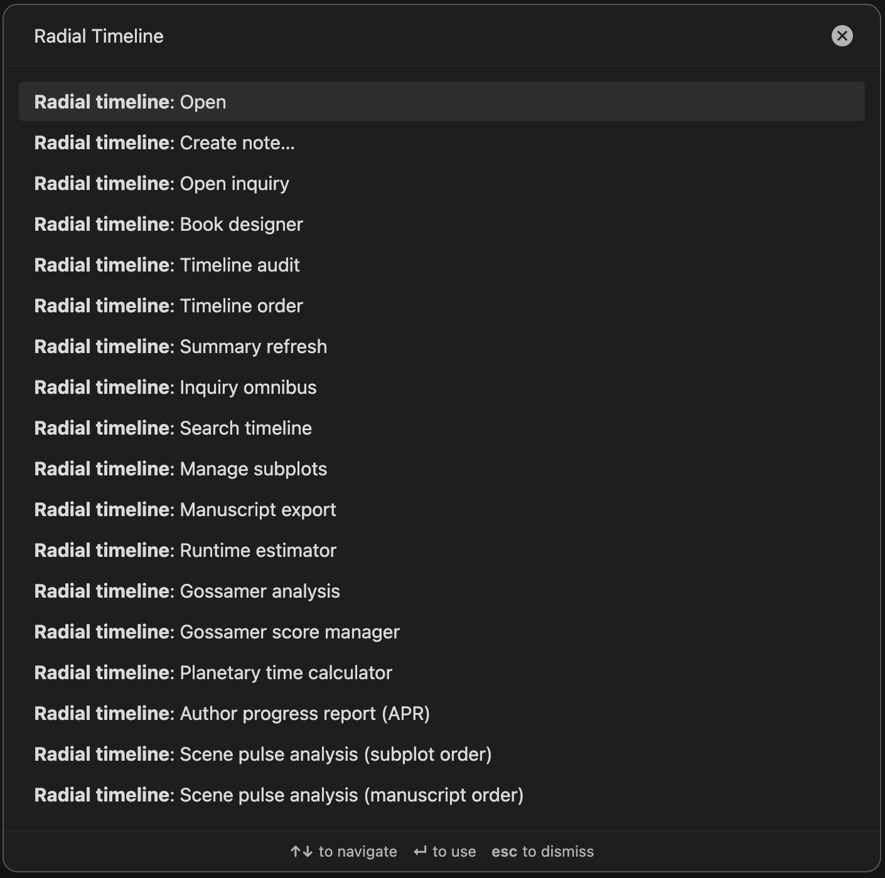
  
Radial Timeline Commands in the palette

## Command Index

These are the main command-palette entries.

1. **Open** — opens the [Radial Timeline View](Radial-Timeline-View).
2. **[Create note…](#create-note)**
3. **Open inquiry** — opens the [Inquiry View](Inquiry).
4. **[Book designer](Book-Designer)** ← standalone guide
5. **[Manuscript onboarding](#onboard-manuscript)** *(in testing — not yet released)*
6. **[Timeline date scaffold](#timeline-order)**
7. **[Timeline date audit](#timeline-audit)** *(beta)*
8. **[Subplot manager](#manage-subplots)**
9. **[Summary scene refresh](#summary-refresh)**
10. **[Timeline search](#search-timeline)**
11. **[Gossamer analysis](#gossamer-analysis)**
12. **[Runtime estimator](#runtime-estimator)** *(Pro)*
13. **[Manuscript export](Manuscript-Export)** ← standalone guide
14. **[Inquiry omnibus](#inquiry-omnibus-pass)** *(in testing — not yet released)*
15. **[Gossamer score manager](#gossamer-score-manager)**
16. **[Planetary time calculator](#planetary-time-calculator)**
17. **[Author progress report (APR)](Author-Progress-Report)** ← standalone guide
18. **[Scene pulse analysis (subplot order)](#scene-pulse-analysis-subplot-order)**
19. **[Scene pulse analysis (manuscript order)](#scene-pulse-analysis-manuscript-order)**
20. **[Timeline share export](#timeline-share-export)**

> **Reassign two hotkeys.** In release 7.4.0, **Open** and **Timeline date scaffold** got new command IDs. If you had assigned a hotkey to either, assign it again in **Settings → Hotkeys**.

## Conditional Visibility

Some commands are hidden until their required feature is enabled. Others remain visible but stop with a setup message if prerequisites are missing:

*   **Scene pulse analysis**, **Summary scene refresh**, and **Gossamer analysis** appear only when **AI LLM features** are enabled in [Settings → AI](Settings-AI).
*   **Open inquiry** stays listed and opens with AI off, so you can read saved sessions, including the demo vaults', without an API key. Running a new question needs AI turned on and a provider. See [Inquiry](Inquiry).
*   **Gossamer analysis** also needs an active beat system, story beats, and scene content. To score by hand without AI, use **[Gossamer score manager](#gossamer-score-manager)**.
*   **Runtime estimator** is a **Pro** workflow. Runtime configuration lives in [Settings → Core](Settings-Core#runtime-estimation).
*   With AI off, the **Timeline date audit** AI scan and the runtime estimator's AI mode tell you AI is off instead of running.
*   **Planetary time calculator** is visible, but it needs at least one configured planetary profile before it can produce a conversion.
*   **Inquiry omnibus** and **Manuscript onboarding** are undergoing testing and are not released yet. They do not appear in release builds.

---

## Create note…

Opens the guided RT note selector.

  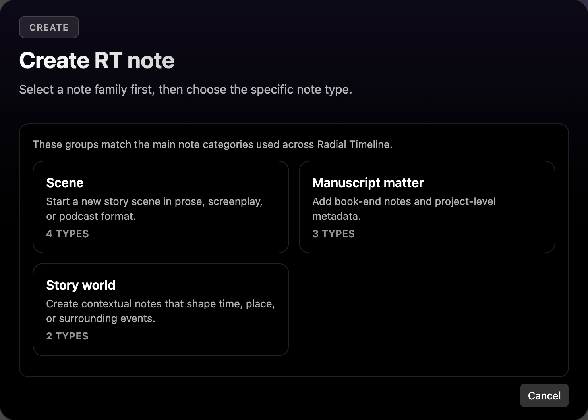

The selector is organized into three families:

*   **Scene** — Core scene, scene with advanced properties, screenplay scene, podcast scene.
*   **Manuscript matter** — Front matter, back matter, `BookMeta`.
*   **Story world** — Beat and Backdrop.

After you choose a subtype, the file is created in the active book folder and opened immediately. Scene creation includes built-in scaffolds: minimal properties for basic scenes, richer metadata for advanced scenes, screenplay/podcast body scaffolds plus runtime defaults for those types.

Related: [Scene Properties (Core + Advanced)](YAML-Frontmatter).

---

## Manuscript onboarding *(in testing — not yet released)*

Opens the guided onboarding flow for importing an existing manuscript.

> [!NOTE]
> Undergoing testing and not released yet — it does not appear in release builds of the plugin. It offers structure-only import or Local LLM assistance — see [Settings → AI → Local LLM](Settings-AI#local-llm) for setup and the hardware guidance in [Onboarding And Local Model Hardware](Settings-AI#onboarding-and-local-model-hardware).

Walks a book folder through a four-stage sequence — preparing and reading the source text, proposing scene splits for confirmation, generating scene profiles (characters, places, summaries) for review, and writing the accepted result to the vault. Each stage is reviewable before it commits anything.

Related: [Settings → AI → Local LLM](Settings-AI#local-llm), [Book Designer](Book-Designer).

---

## Timeline date scaffold

Opens Timeline Date Scaffold, an optional tool for assigning provisional `When` dates in story order. No AI is involved. Chronologue already keeps undated scenes with their narrative neighbors, so scaffolding is not required to use it.

  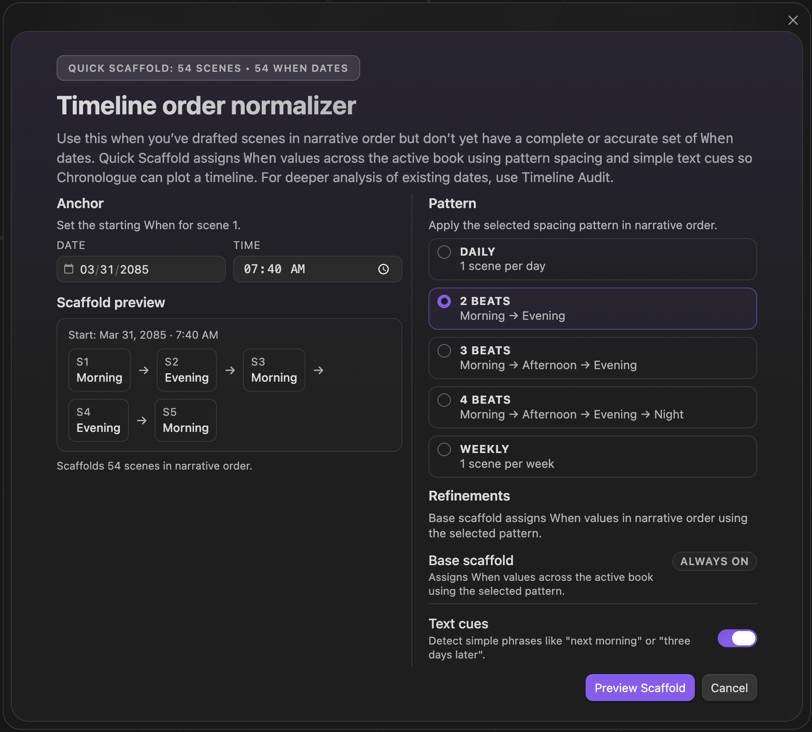

The wizard helps you normalize `When` values in manuscript order, then review the proposed timeline before writing changes back to frontmatter. It supports scaffold-based chronology setup, anchor date and time selection, time-bucket adjustments (morning/afternoon/evening/night), ripple mode for cascading changes, needs-review filtering, and undo/redo before applying.

Use [Timeline date audit](#timeline-audit) to review chronology and continuity findings.

Related: [Chronologue Mode](Chronologue-Mode).

---

## Timeline date audit *(beta)*

Opens the Timeline Date Audit panel.

  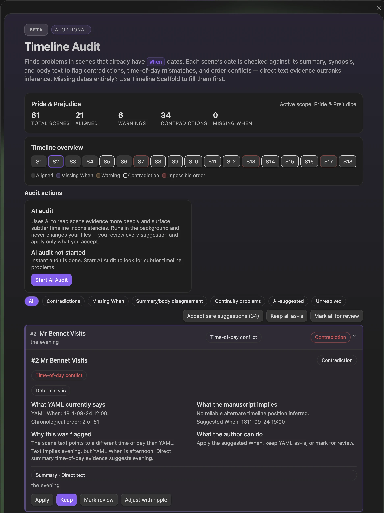

Surfaces contradictions, invalid dates, summary/body disagreement, continuity problems, and unresolved findings. Undated scenes remain visible in their Chronologue display order and have their own **Undated** count and filter; a blank `When` alone is not a warning or an unresolved problem. The panel shows overview stats, finding filters, and finding cards with evidence and suggested actions.

You can audit a partially dated or completely undated book without scaffolding it first. Relative-time checks do not skip across undated scenes to assume a calendar interval, and a date without a clock time is not checked as though noon were authored. Optional AI can examine undated scenes, but should leave their dates unset when the text does not support one. Changes are written only when you accept and apply a suggestion.

The audit includes a deterministic pass and can optionally run a continuity pass. AI findings appear alongside deterministic findings for review. From the panel you can filter findings by issue type, inspect evidence, mark items for review, apply accepted fixes where supported, and rerun the audit after changes.

Related: [Timeline date scaffold](#timeline-order), [Chronologue Mode](Chronologue-Mode).

---

## Subplot manager

Opens the subplot manager for bulk cleanup. Use it when subplot names have drifted.

  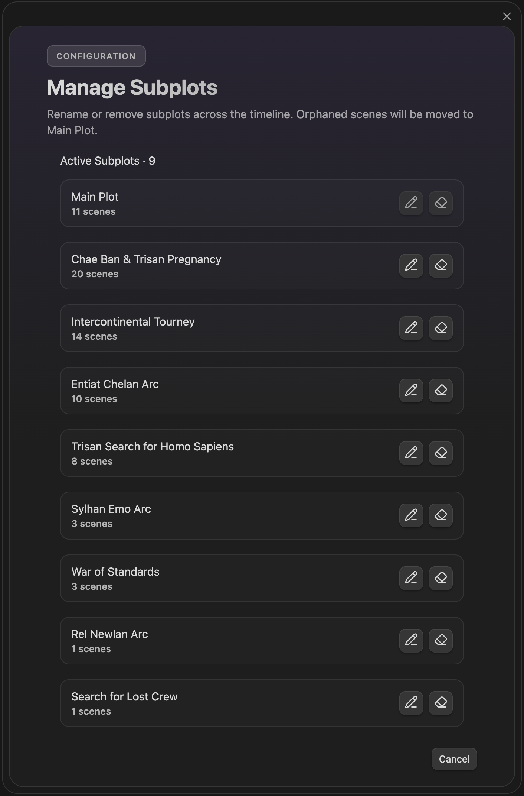

Lists active subplots with scene counts and gives you bulk actions:

*   **Rename** a subplot across scene files.
*   **Remove** a subplot from the timeline.

  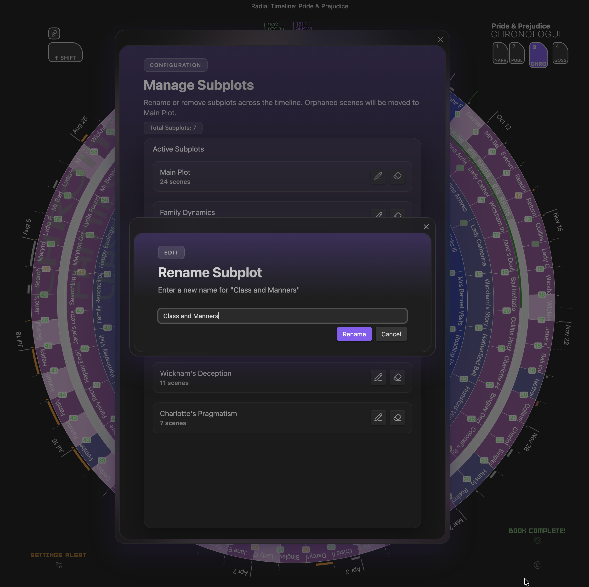
  
Rename a subplot — automatically updates the frontmatter of every scene using it

`Main Plot` is protected and cannot be renamed or deleted. Removing a subplot moves any scenes that only belonged to it back to `Main Plot`.

Related: [Narrative Mode](Narrative-Mode), [How to](How-to#manage-subplots-in-bulk).

---

## Summary scene refresh

Regenerates scene summaries with AI.

  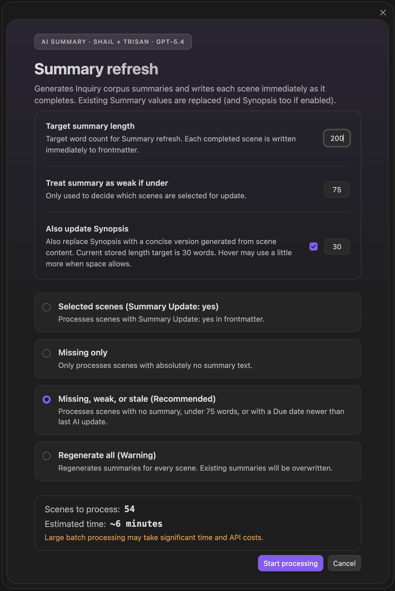

Writes:

*   **Summary** — the longer corpus-oriented summary.
*   **Synopsis** — optional, if you enable `Also update Synopsis`.

Run modes: flagged scenes, missing summaries only, missing/weak/stale, or regenerate all. You can also set target summary length, weak-summary threshold, and optional Synopsis update length.

This command is separate from scene pulse analysis: **Pulse** writes short structured editorial feedback per scene; **Summary scene refresh** writes longer summary text for corpus-level use.

Related: [AI Pulse Triplet Analysis](AI-Pulse-Analysis), [Inquiry View](Inquiry).

---

## Timeline search

Opens the timeline search bar.

  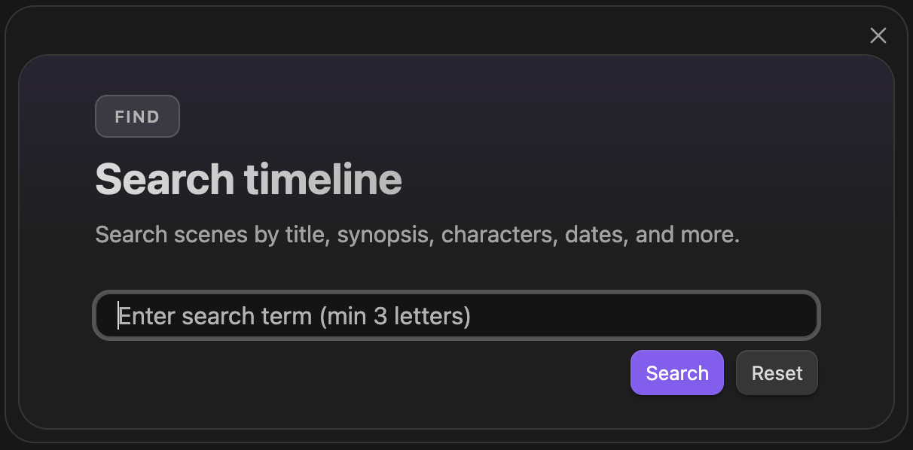

Choose **Timeline fields**, **Scene body**, or both in **Search options**. Press **Enter** for text search, or enable **Local LLM assist** for concept matching with verified evidence quotes. See [Search](How-to#search) for scope, highlighting, and local AI setup.

Related: [How to → Search](How-to#search).

---

## Gossamer analysis

Runs the built-in AI scoring workflow for the active Gossamer signal. Appears only when AI LLM features are on; to score by hand, use [Gossamer score manager](#gossamer-score-manager).

  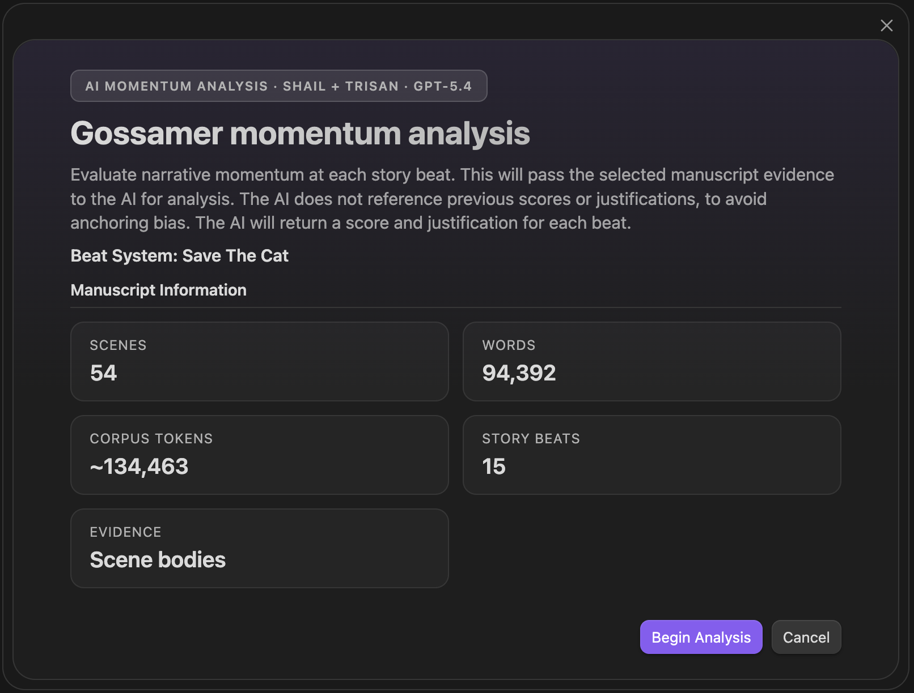

Works against the active beat system and the active signal — Momentum, Tension, Activity, or Interiority. AI scores the supplied manuscript material independently of your visual Momentum ranges.

Related: [Gossamer Mode → AI Analysis](Gossamer-Mode#ai-analysis).

---

## Runtime estimator *(Pro)*

Opens the runtime estimation panel.

  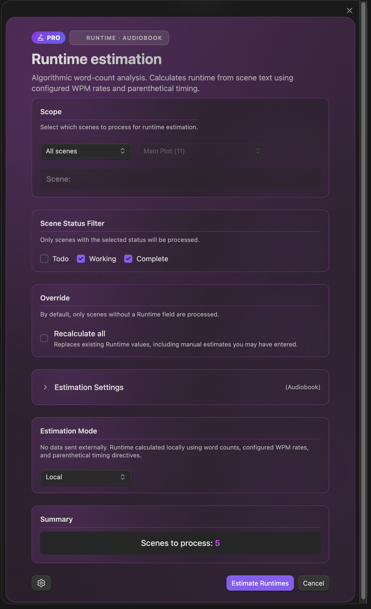

Used for novels, audiobooks, and screenplays. The panel works with runtime profiles and can estimate duration across different scopes and filters. Available only when **Pro** is active.

Related: [Settings → Core → Runtime estimation](Settings-Core#runtime-estimation), [Chronologue Runtime sub-mode](Chronologue-Mode#runtime-sub-mode).

---

## Inquiry omnibus *(in testing — not yet released)*

Runs all enabled Inquiry questions in one batch.

> [!NOTE]
> Undergoing testing and not released yet — it does not appear in release builds of the plugin.

  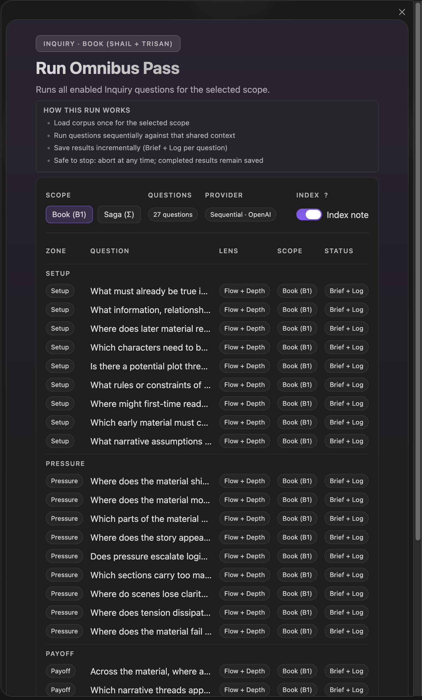

Executes enabled questions across the Inquiry zones and returns a combined set of findings for the current corpus. Works with the active scope (Book or Saga). Depending on provider and engine path, the run may execute as a combined omnibus flow or as sequential provider calls behind the scenes.

Related: [Inquiry View](Inquiry), [Running an Inquiry](Inquiry#running-an-inquiry).

---

## Gossamer score manager

Opens the manual score-entry panel for the active signal.

  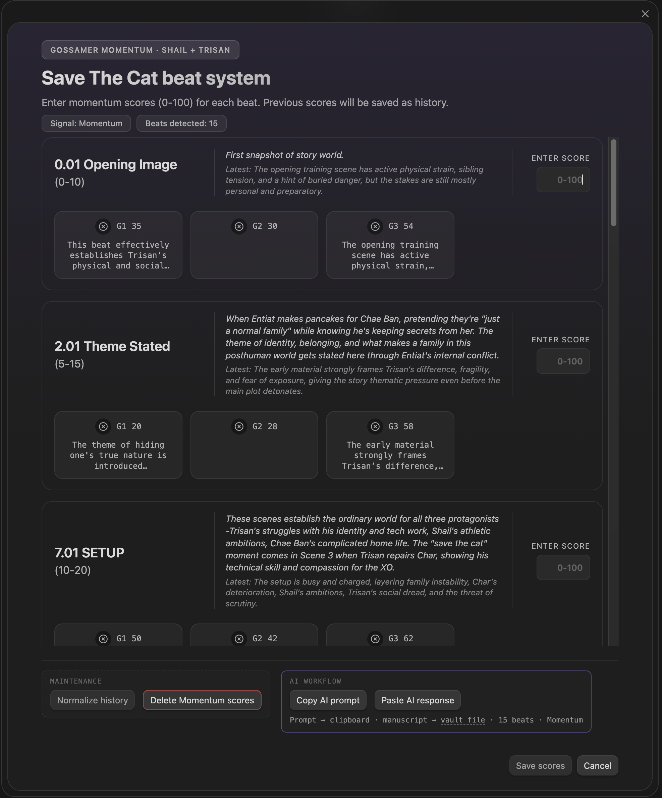

Supports manual score entry, score justifications, run history cleanup and normalization, and working with saved beat runs. Create beat notes for the active beat system before opening the panel.

Related: [Gossamer Mode → Manual Entry](Gossamer-Mode#manual-entry).

---

## Planetary time calculator

Opens the planetary conversion panel.

  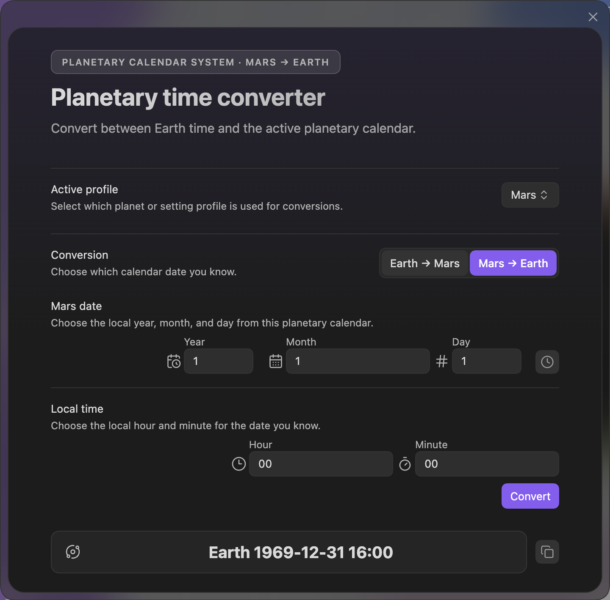

Uses the active planetary profile from [Settings → Core](Settings-Core) and lets you select a date and time, convert that Earth timestamp to local planetary time, and copy a YAML-friendly result block. The refreshed panel is designed for quick Alien Calendar checks while writing. Select an active planetary profile in Settings → Core before converting dates.

Related: [Planetary Calendar](Chronologue-Mode#alt-sub-mode).

---

## Scene pulse analysis (subplot order)

Opens the subplot pulse selector first, then runs pulse analysis for a selected subplot.

  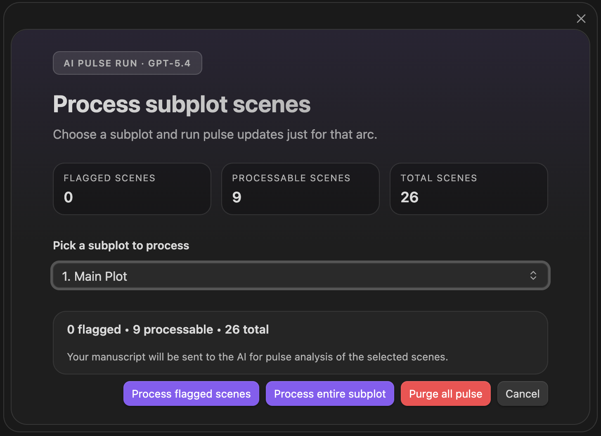

The subplot selector shows flagged scenes, processable scenes, and total scenes. From there you can choose **Process flagged scenes**, **Process entire subplot**, or **Purge all pulse** for that subplot.

Related: [AI Pulse Triplet Analysis](AI-Pulse-Analysis), [Subplot manager](#manage-subplots).

---

## Scene pulse analysis (manuscript order)

Opens the pulse command panel for manuscript-order analysis.

  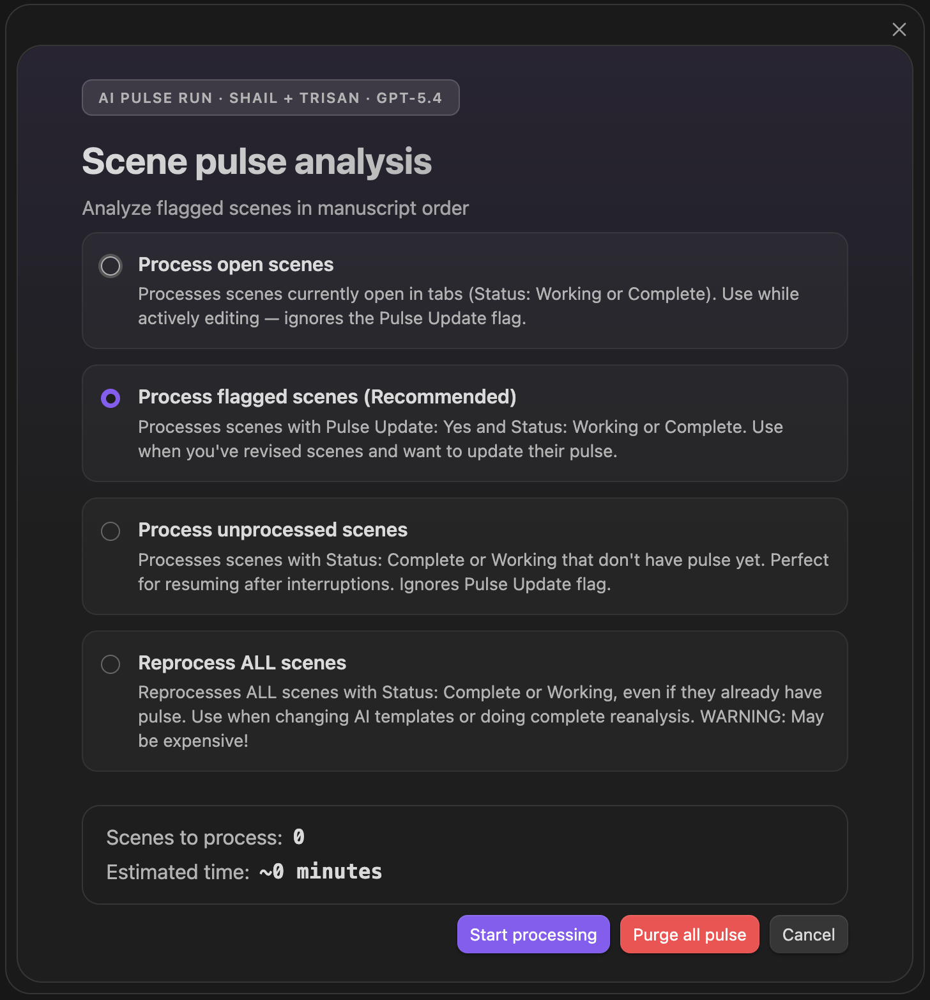

Run modes: process open scenes, process flagged scenes, process unprocessed scenes, or reprocess all scenes.

Related: [AI Pulse Triplet Analysis](AI-Pulse-Analysis), [Summary scene refresh](#summary-refresh).

---

## Timeline share export

Writes the file you upload on your Community **My Share** page to build your Interactive Timeline. Exporting shares nothing: the file is written to `Radial Timeline/Community/` in your vault and stays there until you upload it and activate the share.

Before anything is written, a dialog lists what the file contains:

*   **Shared when you activate:** scene numbers, acts, subplot names, status, publish stage, book title, and author.
*   **Held for per-scene reveal:** scene titles, synopses, characters, POV, and story dates. They stay hidden on your public timeline until you reveal each scene from My Share.

If your subplot names could themselves reveal plot, turn on **Generic ring names** in the dialog to export them as "Subplot 1, Subplot 2…".

Related: [Settings → Community](Settings-Community).
