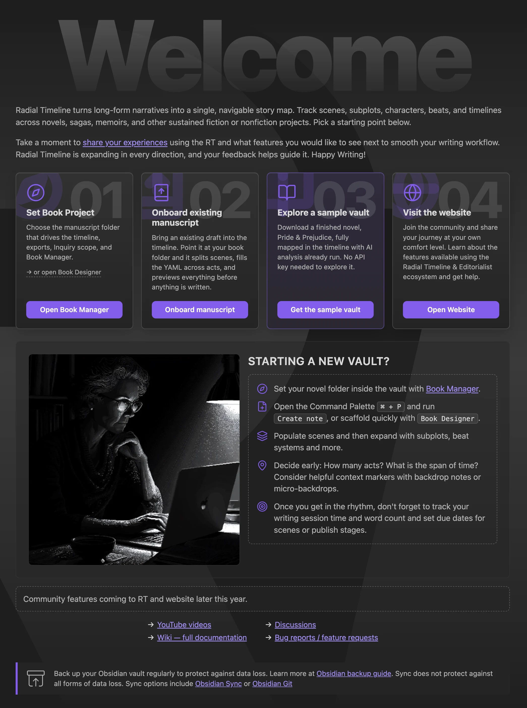

Radial Timeline transforms your manuscript into a live visual map of your story. It works with any Obsidian vault — fresh or existing — by reading and writing scene metadata as note properties (YAML frontmatter) at the top of each note.

You get two workspaces: the **[Radial Timeline View](Radial-Timeline-View)** for scenes, structure, and chronology, and the **[Inquiry View](Inquiry)** for corpus-level analysis. Inquiry, along with Pulse, Gossamer AI analysis, and Summary refresh, requires AI to be turned on first — see the optional step below.

  

    
    
Welcome screen — quick-start guide for new vaults

  

The Welcome screen offers these starting points; onboarding appears in development/testing builds:

1.  **Set Book Project** — choose the manuscript folder that drives the timeline, exports, Inquiry scope, and Book Manager. The right first step for a fresh vault.
2.  **Onboard existing manuscript** — bring an existing draft in from a [Scrivener export, a Word document, or one big file](Onboard-Existing-Manuscript), with or without AI assistance.
3.  **Explore a sample vault** — get the free, fully analyzed [Pride & Prejudice sample vault](Sample-Vault) (sign up with your email and the download link arrives in your inbox). No API key needed to explore it.
4.  **Visit the website** — [radialtimeline.com](https://radialtimeline.com) for support docs and the [Community](Settings-Community), where you can share your writing journey at your own comfort level.

> **Coming from Scrivener, Word, or another tool?** In development/testing builds, use **[Onboard existing manuscript](Onboard-Existing-Manuscript)** — it splits your draft into scene notes, fills the YAML across acts, and previews everything before anything is written. Scene order follows the leading number in each scene's filename and its `Act` field. See [Scene Properties (Core + Advanced)](YAML-Frontmatter) for the full schema.

---

## Setup

Choose a vault layout and stick with it: a single-book vault, a single vault with a dedicated Manuscript folder, or a multi-book vault with one folder per book.

**1. Install and add a book profile.** Install Radial Timeline from Community Plugins, open **Settings → Core → Books**, add a profile, and link its **Source folder** to your manuscript folder.

**2. Bring in scenes.**

*   *Fresh vault:* run **Radial timeline: Book designer** to generate a scaffold (acts, subplots, optional beats), or run **Radial timeline: Create note… → Scene → Basic scene** to start with a single scene.
*   *Existing vault:* your scene notes should use `Class: Scene`. The main scene properties are `Act`, `Synopsis`, and `Subplot`. Chronologue uses `When` and `Duration`; Progress uses `Status` and `Publish Stage`. If your vault uses different property names, enable **Remap frontmatter field keys** under **Settings → Advanced → Configuration**.

**3. Choose a beat system (optional).** Pick from the built-in systems (**Save the Cat**, **Hero's Journey**, **Classic Dramatic Structure**, plus podcast, video, documentary, romance, and thriller arcs) or build a **Custom** system in [Settings → Core → Story beats system](Settings-Core#story-beats-system). Use **Create** to generate beat notes; **Merge** to realign existing files after changes.

**4. Enable AI (optional).** New installs ship with AI off. Turn it on under **Settings → AI → Enable AI LLM features** — this is required for [Inquiry](Inquiry), [AI Pulse Triplet Analysis](AI-Pulse-Analysis), Gossamer AI analysis, and Summary refresh. Configure a cloud provider key or a [Local LLM](Settings-AI#local-llm), then check model readiness before running analysis.

---

## Daily Workflow

The four modes in the Radial Timeline View — switch with `1`/`2`/`3`/`4` or the navigation cluster:

*   **Progress** (`1`) — writing status and revision-stage tracking
*   **Narrative** (`2`) — manuscript order; drag scenes on the outer ring to reorder
*   **Chronologue** (`3`) — story-world time, duration, and gaps
*   **Gossamer** (`4`) — beat-level scoring across Momentum, Tension, Activity, Interiority

**Day to day:** write scenes, keep `Synopsis` current, update `Status` from Todo → Working → Complete. Use **Search timeline** to find scenes across metadata. See [How to](How-to) for task recipes (reordering, subplots, rotation, search).

**When you're ready to share:** run **Radial timeline: Manuscript export** to compile to Markdown, an outline, Word (DOCX), or PDF. Word requires Pandoc; PDF requires [Pandoc](https://pandoc.org/installing.html) and a LaTeX distribution; configure under **Settings → Publish**. See [Publishing](Publishing) for templates and Signature setup.

**Optional next steps:** [AI Pulse Triplet Analysis](AI-Pulse-Analysis) for scene-level editorial feedback, [Inquiry](Inquiry) for corpus-level analysis, [Author Progress Report](Author-Progress-Report) for shareable spoiler-safe progress graphics.

---

> **Protect your work.** Keep regular vault backups alongside sync. See Obsidian's [backup guide](https://help.obsidian.md/backup), [Obsidian Sync](https://obsidian.md/sync), or the [Obsidian Git plugin](https://obsidian.md/plugins?id=obsidian-git).
