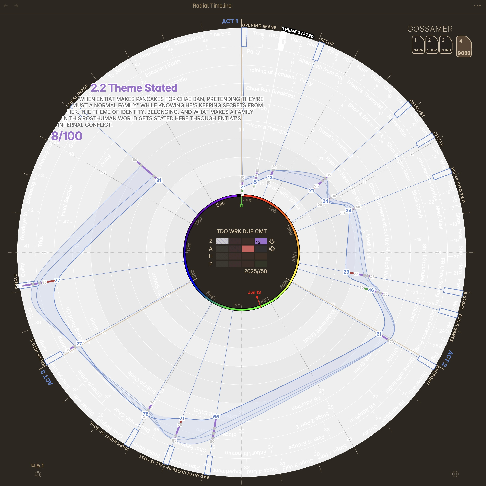
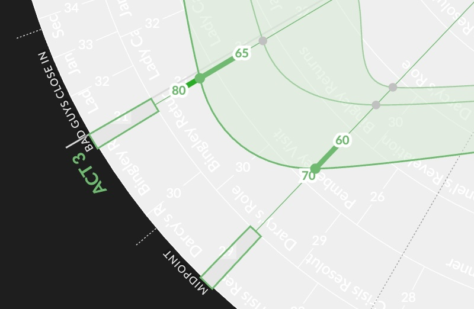
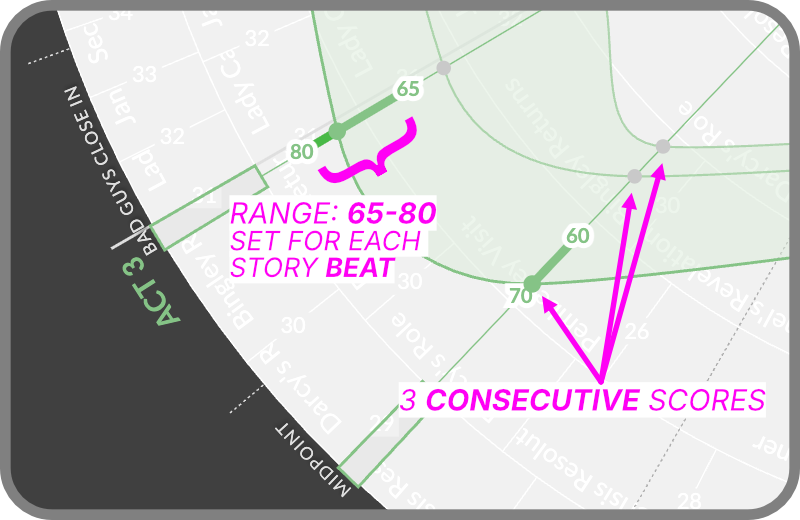

Gossamer Mode visualizes beat-level scoring across your active story beat system. Each saved scoring pass draws a **trace** — a line connecting your beat scores around the timeline. It supports four signals — **Momentum**, **Tension**, **Activity**, and **Interiority** — so you can compare not just how your story moves, but what kind of pressure or interior charge each beat carries.

*   **Four signals**: Score **Momentum**, **Tension**, **Activity**, or **Interiority** against the same beat system.
*   **Trace history**: Compare saved traces across up to 30 slots per beat to track how the shape changes over time.
*   **Top-left traces panel**: Switch signals, show **LATEST** or all traces, and toggle individual saved traces on or off.
*   **Ideal Range**: Beat `Range` values provide a visual target for **Momentum** only. They are not sent to the AI.
*   **Manual score entry**: Enter scores for the current signal yourself, with or without external AI assistance.
*   **Justification capture**: Each score line now records a brief justification so you know what the score was based on.
*   **Normalize & repair**: Use **Normalize history** inside the score manager panel to compact gaps and repair orphaned entries.

**Timeline mode**: Gossamer (key **4**)
**Command**: `Gossamer score manager`
**Settings**: [Story beats system](Settings-Core#story-beats-system)

  
  
Gossamer — saved traces, signal switching, and beat-level scoring

  

    
    
Ideal ranges for story beats

  

  

    
    
Callouts showing score details

  

  
  
Gossamer score manager — manual entry for the active signal

## Subplot Alignment

The **alignment chip** at the left of the mode row switches subplot rings between **Fill** (scenes spread evenly across each act) and **Sequence** (every scene sits at its true position in the full manuscript, with empty cells where a thread is dormant). See [Subplot Alignment in Narrative Mode](Narrative-Mode#subplot-alignment-fill-vs-sequence) — the same control applies here.

## Signals

*   **Momentum**: How strongly the story pulls the reader toward what happens next.
*   **Tension**: How much unresolved pressure, uncertainty, or conflict the reader carries forward.
*   **Activity**: How much is physically or visibly happening on the page.
*   **Interiority**: How intense the character's inner experience is on the page.

## Manual Entry

Use **Gossamer score manager** to enter scores for the active signal. This is a manual workflow by design — you can score purely by your own judgment, or use an external AI tool to help draft scores and justifications, then paste those results into the panel.

## AI Analysis

Use **Gossamer analysis** to run the built-in AI evaluation for the active signal. The AI run intentionally **does not receive ideal range guidance** in its payload/instructions, so the result is a fresh read rather than a range-constrained score.

## Story Beats Configuration

You can configure the underlying system that powers Gossamer Mode in **Settings → Core → Story beats system**.

### 1. Select a System
Choose a preset structure:
*   **Save The Cat** (15 beats)
*   **Hero's Journey** (12 beats)
*   **Custom**: Define your own structure.

### 2. Custom Beat System
When "Custom" is selected, the beat system editor appears:
*   **Name**: Give your system a name (e.g., "7 Point Structure"). This is written to the `Beat Model` YAML field.
*   **Add beats**: Type a name and click **+** to add a new beat. Assign each beat to an act using the dropdown.
*   **Reorder**: Drag and drop beats to change their order within or across acts.
*   **Rename**: Edit beat names inline. After renaming or reordering, use **Merge** to update existing files.
*   **Beat properties editor**: Customize additional beat properties and select which fields appear in beat hover metadata (stored per system).
*   **Saved sets**: Save and switch between multiple custom beat systems. Each system stores beats plus Beat properties editor fields and hover metadata.

Row colors show the sync status between your beat list and the actual note files:
*   **Green** — beat note exists and is aligned.
*   **Orange** — beat note exists but is misaligned (wrong act). Merge to fix.
*   **Red** — duplicate title or multiple files match. Resolve manually.
*   **No highlight** — new beat, no file yet.

### 3. Create & Merge
*   **Create**: Generates beat notes in the active book folder, one per beat. Notes come pre-populated with properties (`Class: Beat`, `Purpose`, `Beat Model`, `Range`, etc.) so they are immediately recognized by Gossamer Mode. The button is disabled when all beats already have files, and shows how many new notes will be created.
*   **Merge**: Appears when beats are misaligned. Updates existing beat note frontmatter to match current act assignments (and fills missing Beat Model/Beat Id where applicable). It does not rename files or enforce numeric prefix conventions.

> [!NOTE]
> Custom beat notes use the same properties structure as preset systems. Use the Beat properties editor to extend this with your own fields.
