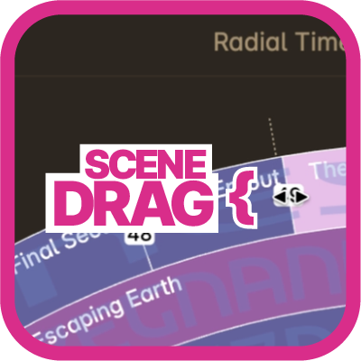
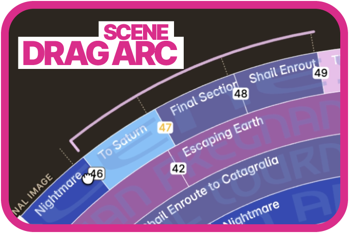
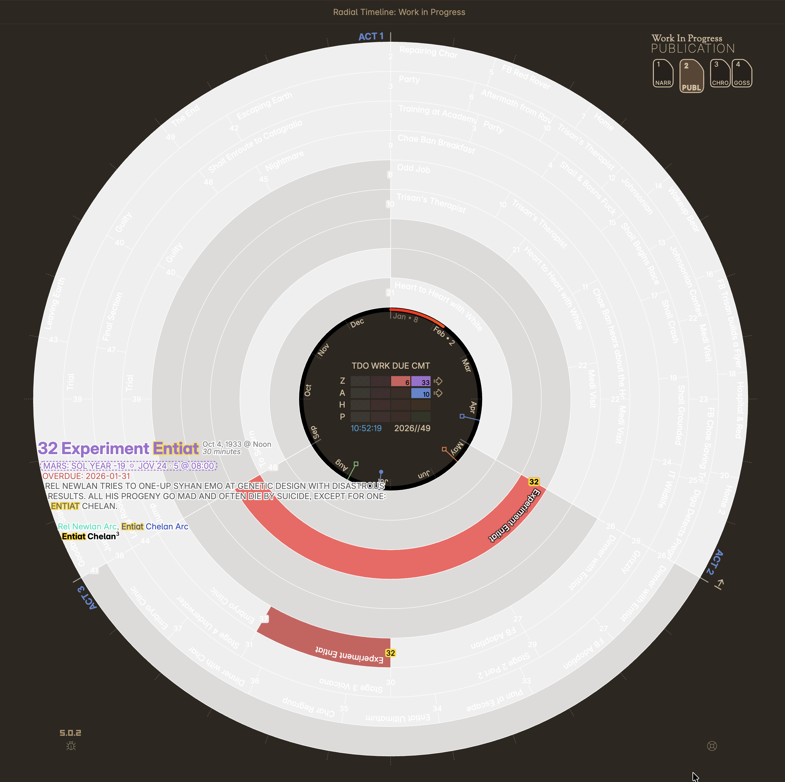

### Reorder Scenes

Scenes in Radial Timeline can be reordered in two ways: **by renaming the scene title** or **by dragging scenes in Narrative Mode**.

---

#### Prefix Numbering Convention

- **Scenes** use canonical integer prefixes: `1`, `2`, `3`, ...
- **Beats** use decimal minor prefixes between scene integers: `1.01`, `1.02`, ...
- **Front matter** typically uses `0.xx`; **Back matter** uses `200.xx`.
- Use two-digit minor parts (`.01`, `.02`) for stable Obsidian filename sorting.

---

#### Method 1: Reorder by Scene Title (All Versions)

Radial Timeline uses the **leading scene number in the scene title** to determine order.

Example:

    1 Tom rides a bike

- `1` = scene order  
- `Tom rides a bike` = scene title  

To move the scene, change the leading number:

    3 Tom rides a bike

The scene is now treated as Scene 3.  
Only the number controls ordering—the text after it is the title.

---

#### Acts and Scene Order

Scene order is **act-specific**.

Changing the scene number moves the scene **within its current act**. Update `Act` to move it between acts.

Example YAML:

    Act: 1

With `Act: 1`, the highest-numbered scene appears at the **end of Act 1**.

To move a scene to a different act, update the YAML:

    Act: 3

Always update both:
- the **scene number in the title**
- the **Act field in YAML**, if changing acts

---

#### Method 2: Drag & Drop (Narrative Mode Only)

- Switch to **Narrative Mode**
- Drag a **scene** or **beat note** on the **outer ring** (cursor becomes double arrow)

- Drop the scene into its new position on the **numbered scene square**

- Confirm the change when prompted

This method automatically updates ordering for you.

**Note:** Dragging is supported on the **outer ring only**. You can drag into an empty act by dropping onto one of the empty **void** cells for that act.

---

#### Summary

- Scene order is controlled by the **number at the start of the title**
- Scene order is **scoped to the Act**
- Changing acts requires updating the **YAML `Act:` field**
- Narrative Mode supports **drag-and-drop reordering**

### Manage Subplots in Bulk

Need to rename or delete a subplot across dozens of scenes? Use the **[Manage subplots](Commands#manage-subplots)** command (command palette → "Radial timeline: Manage subplots"). The panel lets you:

* Rename a subplot and automatically update the frontmatter of every scene using it.
* Delete a subplot and strip the tag from all scenes in one action.

Use it to keep subplot names consistent after reorganizing your story.

### Search

  
  
Search — matching scenes highlighted in yellow across all subplot rings

Open **Radial timeline: Search timeline**, choose **Search options**, and press **Enter** to search.

*   **Timeline fields** searches scene titles, synopses, characters, subplots, durations, dates, planetary-time text, and custom properties enabled in hover metadata.
*   **Scene body** searches the prose. Open a matching scene to see the matching passages highlighted in the editor.
*   **Local LLM assist** finds concept matches in the selected scopes using your configured local model. Each accepted match includes a quote verified against the searched text. The panel reports progress, dropped claims, and unreadable scenes; **Cancel** stops a running search.

Timeline fields is selected by default. Your scope choices are saved. Matching scene numbers light up across subplot rings; hover highlights apply to matches in timeline fields. Use **Clear timeline search** to clear the results.

Local LLM assist sends the selected material to your configured Local LLM endpoint. Use a server on the same machine to keep manuscript text on-device.

### Rotate the timeline
In Narrative and Progress modes you can use the **rotation toggle** (arrow icon near the outer ring) to rotate the timeline for easier reading. The rotation offset is **act-aware** (based on your configured **Act count**) and keeps scene number squares oriented correctly.
