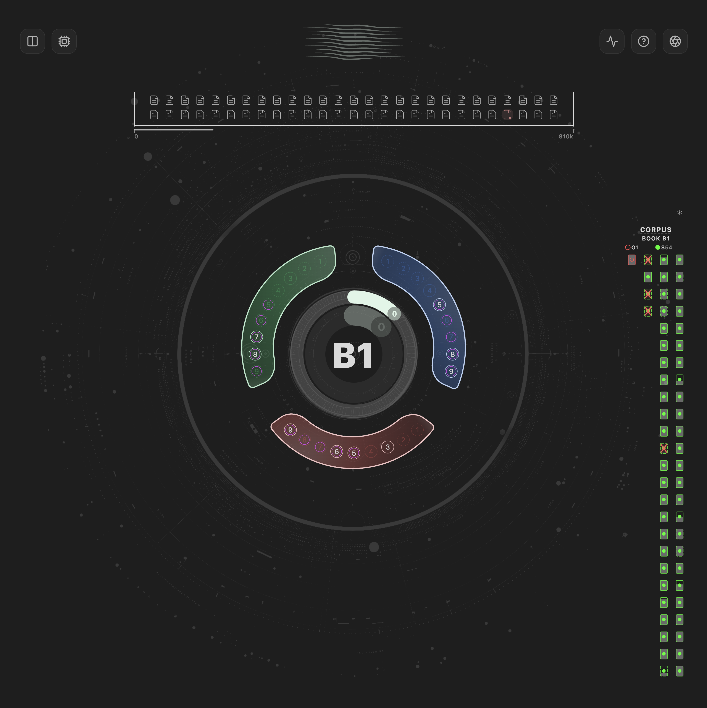

Inquiry is the main operating guide for the Inquiry View. While the [Radial Timeline View](Radial-Timeline-View) focuses on scene-level work, Inquiry takes a higher-altitude perspective — scanning your manuscript corpus and worldbuilding to surface structural signals, loose ends, continuity issues, and pressure gaps across a book or saga.

  
  
Inquiry view — visual glyph with Flow and Depth analysis rings

## Overview

Inquiry sends your manuscript corpus to an AI provider and asks structured questions organized into three narrative zones. The AI returns findings with headlines, recommended actions, evidence quotes, and scene citations that are visualized in the Inquiry glyph.

**Commands**:
*   `Open inquiry` — Opens the Inquiry view

**Settings**: [Inquiry settings](Settings-Inquiry)

---

## Key Concepts

### Zones

Inquiry organizes questions into three narrative zones that correspond to the structural arc of your story:

| Zone | Focus | Examples |
| :--- | :--- | :--- |
| **Setup** | Foundations and introductions | Character introductions, world-building, initial stakes |
| **Pressure** | Escalation and conflict | Rising tension, subplot intersections, pacing |
| **Payoff** | Resolution and conclusion | Loose ends, thematic resonance, climactic impact |

### Modes

Each Inquiry run produces two complementary analyses:

*   **Flow** — Evaluates narrative momentum: pacing, tension arcs, scene-to-scene energy, and structural rhythm.
*   **Depth** — Evaluates thematic substance: character development, motif recurrence, emotional resonance, and subtext.

The Inquiry glyph visualizes both scores as concentric rings, giving you a snapshot of your story's structural health.

### Scope

*   **Book** — Analyzes scenes within the active book folder (single manuscript).
*   **Saga (Σ)** — Expands analysis across multiple books using configured scan folders, ideal for series continuity checks.

---

## The Inquiry Glyph

The visual interface centers on a radial glyph:

*   **Flow ring** (outer) — Represents narrative momentum score (0–1).
*   **Depth ring** (inner) — Represents thematic depth score (0–1).
*   **Zone segments** — Three segments (Setup, Pressure, Payoff) around the glyph show per-zone health.
*   **Minimap** — Scene citations from findings are highlighted, showing where issues cluster in your manuscript.

Click zone segments or findings to drill into specific analysis results.

### Minimap

The Minimap gives you a compact view of where findings land in the scanned corpus. It helps you see clustering, sparse coverage, and the relationship between current findings and the underlying manuscript.

Use the Minimap to:

*   spot where issues concentrate
*   jump from a finding back to source material
*   compare the currently scanned corpus against the active result

---

## Corpus Manager

Corpus Manager is the in-view scope manager for Inquiry. It lets you control which material participates in the current run and apply corpus overrides without leaving the view.

Use Corpus Manager to:

*   switch between **Book** and **Saga** scope
*   apply in-view corpus overrides
*   narrow the active material before a single question or Omnibus run

Any Corpus Manager overrides applied in the view affect the current Inquiry session and are respected by Omnibus runs.

---

## AI Engine Popover

The AI Engine Popover shows the current Inquiry engine context for the active run.

Use it to check:

*   which AI engine is currently resolved
*   readiness and run constraints
*   request-size and corpus context
*   whether you need to open **Settings → AI** before running

Inquiry works with all supported AI providers, including Anthropic, OpenAI, Gemini, and Local LLM configurations.

---

## Running an Inquiry

### Single Question

1.  Open the Inquiry view (`Open Inquiry` command or click the Inquiry ribbon icon).
2.  Select your **scope** (Book or Saga).
3.  Hover a **question** inside the desired zone (Setup, Pressure, or Payoff) to preview the prompt and payload details, including the token estimate.
4.  Click the question's **number badge** to run that single question against your selected AI provider.
5.  Review findings in the results panel — each finding includes a headline, supporting bullets, a recommended action, and scene citations.

### Omnibus Pass *(beta)*

The Omnibus Pass runs all enabled questions across all three zones in sequence via the `Inquiry omnibus` command. It is currently available in development builds only.

**Corpus overrides**: Any Corpus Manager overrides set in the Inquiry view are applied to the Omnibus run. If no overrides are active, the run falls back to the Inquiry Settings corpus configuration.

---

## Corpus & Material Modes

Inquiry builds a "corpus" from your manuscript files before sending them to the AI. You can control what each YAML class contributes:

| Material Mode | What Is Sent | Best For |
| :--- | :--- | :--- |
| **Full** | Complete note body content | Scenes you want deep analysis on |
| **Summary** | `Summary` field only | Lower token usage while preserving high-level context |
| **None** | Excluded entirely | Reference notes, worldbuilding docs you want to skip |

Configure per-class material modes in [Inquiry sources](Settings-Inquiry#sources).

### Corpus Content (CC) Thresholds

The Corpus system classifies notes by word count to help you spot thin content:

| Tier | Default Range |
| :--- | :--- |
| Empty | ≤ 10 words |
| Sketchy | 11–299 words |
| Medium | 300–999 words |
| Substantive | ≥ 1,000 words |

Notes that remain Empty or Sketchy are marked automatically in the Corpus view. Adjust thresholds in [Corpus (CC)](Settings-Inquiry#corpus).

---

## Findings

Each Inquiry result contains **findings** — specific observations the AI identified:

| Finding Kind | Description |
| :--- | :--- |
| **Loose end** | An element introduced but never resolved |
| **Continuity** | A consistency issue between scenes |
| **Escalation** | A tension or stakes progression issue |
| **Conflict** | A structural or thematic conflict |
| **Unclear** | An ambiguous element needing clarification |
| **Strength** | Something that is working well |
| **Thread / Arc / Payoff / Structure** | Thread tracking, character arcs, payoff delivery, and structural observations |

Each finding includes:
*   **Headline** and supporting bullets
*   **Recommended action**
*   **Evidence quote** from the source material
*   **Scene citations** linking back to specific notes

---

## Briefing Manager

Briefing Manager is the Inquiry popover for recent briefing sessions and related actions.

Use Briefing Manager to:

*   reopen recent Inquiry sessions
*   clear or reset corpus-related state
*   purge Inquiry-generated action notes when needed
*   review saved briefing history tied to the current view context

## Briefings

Inquiry can save results as markdown briefings for later review. Briefings are stored in `Radial Timeline/Inquiry/Briefing`.

## Briefing Articles

Inquiry can also produce **Briefing Articles** — HTML-formatted presentation output for reading or sharing in a more polished layout than the markdown briefing.

---

## Action Notes

Inquiry can write findings directly into your scene frontmatter:

*   **Enable**: Toggle **Auto-populate Pending Edits** in [Inquiry settings](Settings-Inquiry).
*   **Target field**: Findings are appended to the `Pending Edits` YAML field.
*   **Purge**: Use the purge function in the Inquiry view to remove all Inquiry-generated action notes from scenes.

---

## Prompts

Each zone ships with built-in questions: **4 core questions** per zone for everyone, and Pro unlocks **5 more** per zone — **9 built-in questions** per zone in total.

You can also add your own custom questions on top of the built-ins:

*   **Free**: Up to 3 custom questions per zone.
*   **Pro**: Up to 8 custom questions per zone.
*   Drag to reorder questions within a zone.
*   Toggle individual questions on/off.
*   Reset to built-in defaults using the restore button.

Configure prompts in [Inquiry prompts](Settings-Inquiry#prompts).

---

## Sources & Material Rules

Control which vault content Inquiry can access:

*   **Books for Inquiry**: Choose which book profiles Inquiry scans.
*   **Material rules**: Toggle which YAML classes are scanned per scope (Book, Saga, Reference).
*   **Supporting material folders**: Add support-material paths beyond the book folders. Supports wildcards (e.g., `/Book 1-7 */`) and `/` for vault root.
*   **Presets**: Choose Default (recommended), Light (fast, lower token usage), or Deep (comprehensive, higher token usage).

Configure sources in [Inquiry sources](Settings-Inquiry#sources).

---

## Tips

*   Start with **Book** scope and a single question to calibrate before running an Omnibus Pass.
*   Use **Summary** material mode for large manuscripts to reduce token usage while maintaining context.
*   Review the **token estimate** indicator before running — amber and red tiers indicate high token consumption.
*   Combine Inquiry findings with [AI Pulse Triplet Analysis](AI-Pulse-Analysis) for both macro and micro-level feedback.
*   Inquiry works best when you calibrate scope, corpus, and prompt count before running larger passes.

---

## Troubleshooting

If the Inquiry view looks disabled or won't run, work down this list:

*   **No book selected yet.** Inquiry scopes to the active book, so opening it in a fresh vault — before the plugin knows where your manuscript lives — leaves it with nothing to scan. Step 1 is always: point the plugin at your book in **Settings → Core → Books** (Book Manager). In the [sample vault](Sample-Vault), skip the settings trip entirely: open the **Welcome screen** and click **Open the sample vault** — it detects the packaged book and drops you straight into the timeline.
*   **AI is off.** New installs ship with AI disabled. Turn it on under **Settings → AI → Enable AI LLM features** — Inquiry cannot run without it.
*   **No API key.** Without a provider key, Inquiry is deliberately **read-only, not broken**: saved briefings and session history stay browsable (this is how the [Pride & Prejudice sample vault](Sample-Vault) works out of the box), but run controls stay disabled. Add a provider key under **Settings → AI** to run new inquiries.
*   **The selected model isn't Inquiry-eligible.** Not every provider/model can run Inquiry — it needs structured output and a large context. Open the [AI Engine popover](#ai-engine-popover) and check the readiness strip; if it shows blocked, it names the reason. Local models can qualify (the validation card in Settings → AI shows an "Inquiry eligible" badge), but smaller local models may not.
*   **Empty corpus.** If the scanned corpus finds no scenes, check [Scan Folders & Class Scope](#scan-folders-and-class-scope) and the Corpus Manager — the scan folder must contain your scene notes, and the class scope must include them.
*   **Costs look wrong mid-run.** The Omnibus panel shows live cost and includes a cache-health kill-switch; if cached-input pricing misbehaves, disable caching there and re-run.
