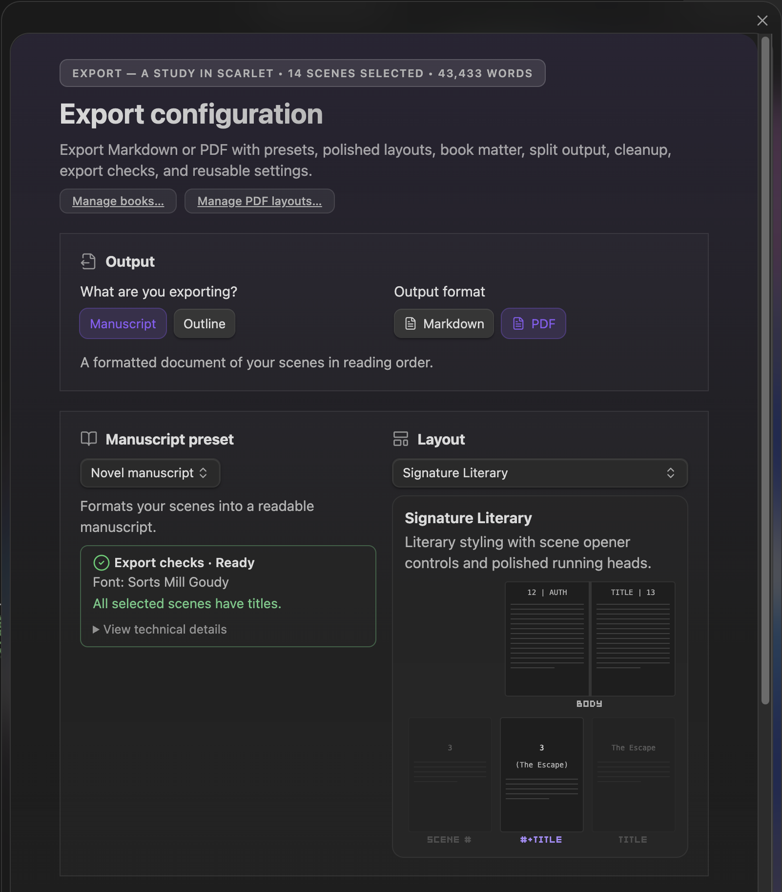

`Manuscript export` opens the export panel for compiled manuscript and outline outputs.

  
  
Manuscript export — filtering, ordering, range, and output controls

## What It Can Export

Choose from:

*   compiled Markdown manuscripts
*   PDF manuscripts (typeset via Pandoc + LaTeX)
*   Word (DOCX) manuscripts in standard submission format
*   outline-style exports
*   filtered or ranged exports by order and subplot

Core includes compiled Markdown, Pandoc PDF export with the Basic and Standard layouts, and Word submission export. Pro adds the Professional, Signature, Screenplay, and Podcast Script layouts plus deeper publishing customization (custom Pandoc metadata, custom LaTeX preamble, the PDF style designer).

The panel supports ordering, selection range, output presets, and publishing-oriented layout decisions in one place.

## Word (DOCX) Submission Export

The **Word** format produces a `.docx` in standard manuscript format — the layout agents and editors expect for queries and submissions: Times New Roman 12 pt, double-spaced, 0.5" first-line indents, centered chapter headings that start on a new page. Styling comes from a bundled Word reference document installed into your Pandoc folder (`reference-manuscript.docx`); configure Pandoc under **Settings → Publish** to use it.

Front & back matter Book Pages can be included, and the export cleanup toggles (comments, links, callouts) apply the same way they do for PDF.

## Print Binding Gutter (PDF)

PDF options include a **Print binding gutter** toggle. When on, exports add 0.25" to the inner margin so text clears the spine of a printed, bound paperback (KDP/IngramSpark). Leave it off for PDFs meant to be read on screen — it changes the page geometry. The setting persists across exports.

## PDF Layouts

For PDF exports, choose a novel PDF layout from the layout selector. The selected layout controls the page style, required font checks, chapter opener behavior, and whether the export prints Part pages.

The preview cards show the expected chapter, part, and body-page structure before export. Export checks report missing Pandoc, LaTeX, bundled fonts, and layout-token problems before you generate the PDF.

The selected novel PDF layout is remembered per book. Narrative Mode uses that same setting for chapter and part placards on the timeline. See [Narrative Mode](Narrative-Mode#chapter-and-part-placards).

## Related Docs

*   [Publishing](Publishing)
*   [Publishing → Exporting a Manuscript](Publishing#exporting-a-manuscript)
