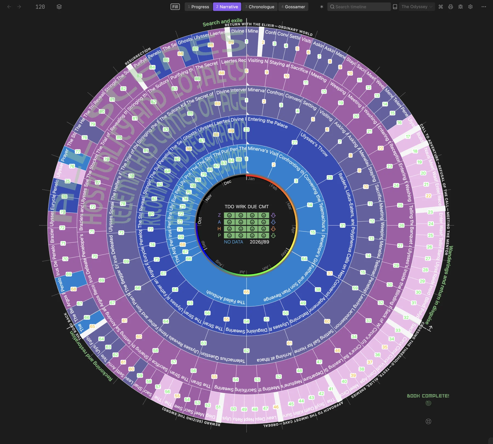
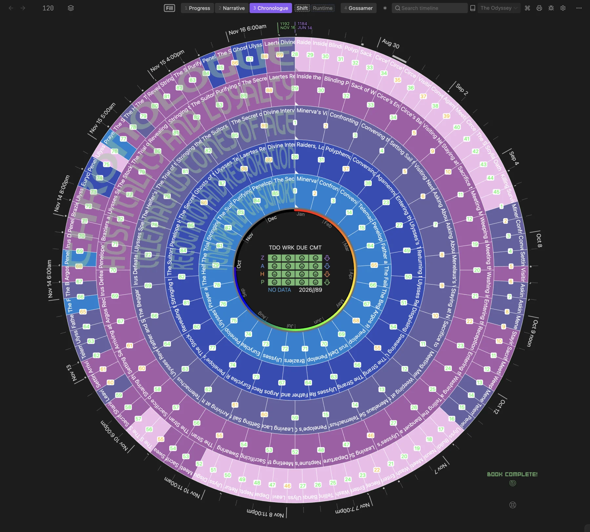
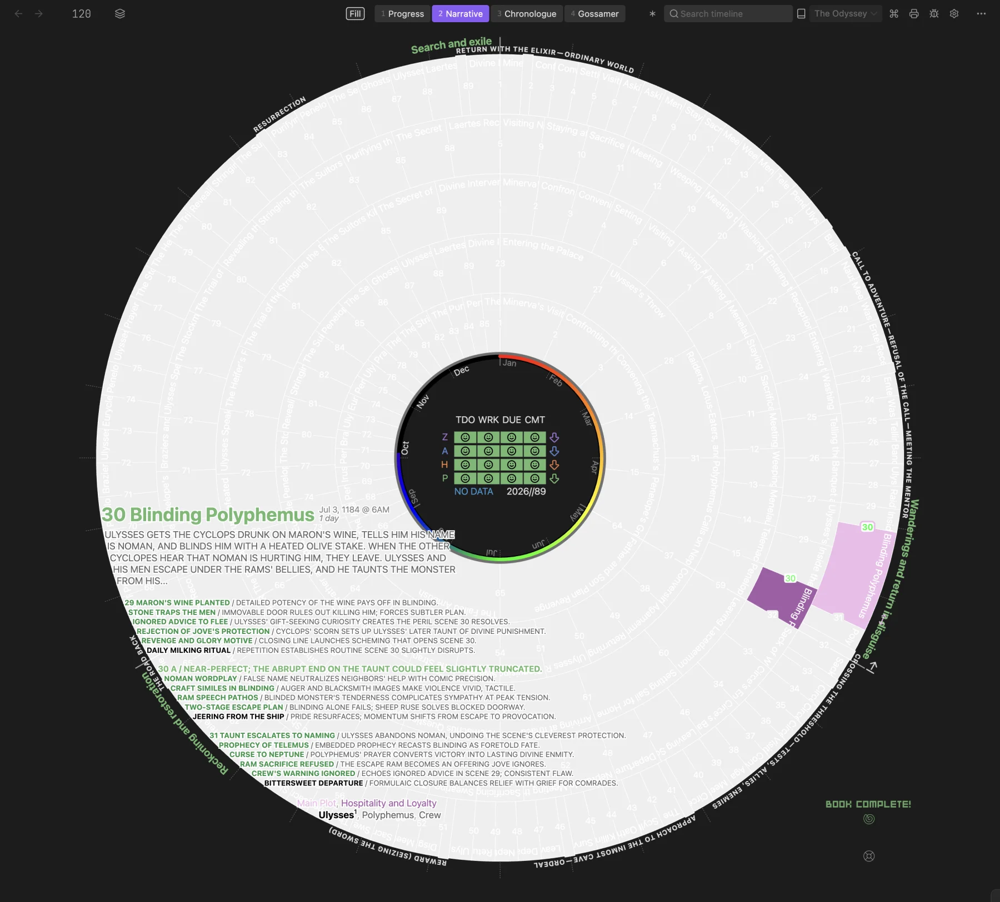

*The Odyssey* is the second free demo vault: the epic traditionally attributed to Homer, in Samuel Butler's public-domain prose translation, mapped as 89 scenes across all 24 books with its analysis already saved. Like the [Pride & Prejudice demo vault](Sample-Vault), it's free, and you can explore its saved analysis without an API key.

  
  
Narrative mode: the outer ring carries every scene; four motif rings read the poem along other paths

## How to get it

1.  In **Settings → PRO → Demo vaults**, click **View demo & download** on The Odyssey's card. It opens the download page on [radialtimeline.com](https://www.radialtimeline.com/resources/free).
2.  Unzip the download and, in Obsidian, choose **Open another vault → Open folder as vault**.
3.  Turn on community plugins when Obsidian asks, then install **Radial Timeline** from **Settings → Community plugins → Browse**. The download holds the book and its notes only, with no Obsidian settings or plugin files.

## Why The Odyssey

The poem doesn't run in a straight line, which makes it a good test of a radial timeline. It opens with Telemachus while Ulysses is still missing. Ulysses then tells his own earlier wanderings to the Phaeacians, and the last books return to Ithaca for disguises, recognitions, tests, and reversals.

## What's inside

*   **89 scenes and 12 beats.** The complete narrative, divided into scenes across all 24 books, plus 12 Hero's Journey beat notes. Every scene has a synopsis, act, story-time date and duration, subplot, point of view, character and place links, and a citation back to the source.
*   **Three acts.** *Search and exile* (Books 1–9), *Wanderings and return in disguise* (Books 10–16), and *Reckoning and restoration* (Books 17–24).
*   **Five rings in Narrative mode.** The Main Plot follows Ulysses's homecoming. Four motif rings offer other reading paths: *Telemachus Comes of Age*, *Hospitality and Loyalty*, *Penelope and the Suitors*, and *Recognition and Restoration*.
*   **51 characters and 27 places.** Selected for the scenes that need them, with Butler's names first and familiar Greek names as aliases (Ulysses is also Odysseus).
*   **Saved analysis.** Every scene has a reviewed summary and synopsis and a saved [Pulse](AI-Pulse-Analysis) analysis. The 12 beats carry all four [Gossamer](Gossamer-Mode) signals. Three saved [Inquiry](Inquiry) answers explore setup, pressure, and payoff, with 79 quoted observations linked to their scenes, and you can read them with AI turned off.
*   **The source text.** The unmodified Project Gutenberg edition (eBook #1727).

## A story told out of order

  
  
Chronologue mode: Ulysses's account of his wanderings moves back years, ahead of scene 1

Books 9–12 are Ulysses's own account of his wanderings, told at the Phaeacian court years after the events. The vault dates those scenes to when their events happened, so **Chronologue** moves them to the start of the timeline, ahead of scene 1. Shorter stories told inside a scene, such as Nestor's and Menelaus's, keep the date of the telling.

**About the dates:** Radial Timeline counts years forward and has no BCE, so the vault uses a notional calendar. It anchors the fall of Troy at the year 1184 and counts forward from there, keeping the poem's intervals, including a year with Circe and seven years with Calypso. The years shown are illustrative coordinates, not historical dates.

## Every scene annotated

  
  
Hover a scene for its synopsis, Pulse analysis, subplots, and characters

Hover any scene to read its synopsis and Pulse analysis. The AI readings are curated interpretations; compare their judgments with the complete source text in the vault.

## Editorial choices

*   **Point of view is set per scene.** Homer's narrator is omniscient (`omni`). Scenes told in the first person, such as Ulysses's wanderings, Menelaus's story of Proteus, and the invented Cretan tales, are `first`, with the storyteller listed first under `Character`.
*   **The Hero's Journey is an interpretation.** The beats follow manuscript order. They are a reading of the poem, not a claim that it fits a modern template.
*   **Selective notes.** Character and place notes cover the figures that matter to the story, not every name that appears once.

The scene divisions, properties, and notes are editorial material made for the demo. You're welcome to copy them, change them, or use them as a starting point for learning Radial Timeline.
