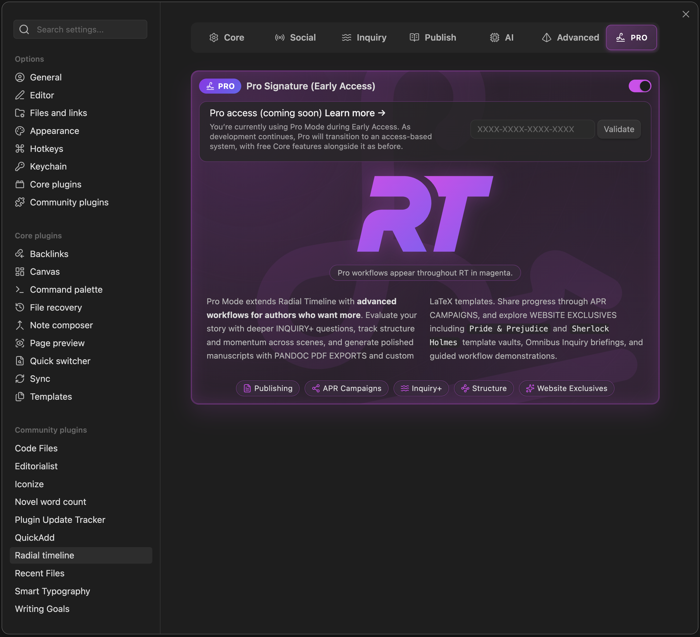

  
  
Settings → PRO

**Advanced workflows for authors who want more.**

Pro is a collection of Pro workflows — the deeper end of Radial Timeline. Evaluate your story with deeper Inquiry questions, track structure and momentum across scenes, and generate polished manuscripts with Pandoc PDF exports and custom LaTeX templates. Share progress through APR campaigns, and explore Website Exclusives.

Pro workflows appear throughout Radial Timeline in magenta.

---

## Pro workflows

*   **Inquiry+** — the extended question set and a higher custom-question ceiling per zone. See [Settings → Inquiry](Settings-Inquiry) and [Inquiry](Inquiry).
*   **Runtime estimation** — screen time, audiobook duration, and manuscript-length analysis. See [Runtime estimator](Commands#runtime-estimator), [Chronologue Runtime](Chronologue-Mode#runtime-mode-pro), and [Settings → Core](Settings-Core#runtime-estimation).
*   **Advanced publishing layouts** — the Professional, Signature, Screenplay, and Podcast Script templates, plus designed-style editing, template import, and custom Pandoc/LaTeX metadata. See [Publishing](Publishing) and [Manuscript Export](Manuscript-Export).
*   **Campaign Manager / Teaser Reveal** — multiple APR campaigns and staged public reveals. See [Author Progress Report](Author-Progress-Report).
*   **Saga timeline scope** — view an entire multi-book saga on one timeline.
*   **Custom scene colors and patterns** — author-defined palettes and working-pattern motifs. See [Settings → Core](Settings-Core).

---

## Website Exclusives

Template vaults such as *Pride & Prejudice* and *Sherlock Holmes*, Omnibus Inquiry briefings, and guided workflow demonstrations. See [radialtimeline.com](https://radialtimeline.com).

---

## Inquiry runs on your own key

Inquiry uses the provider key you add in **Settings → AI**. Your key, your models — Radial Timeline does not stand between you and your provider, and you can change or remove the key at any time.

---

*Questions or feedback? Visit [radialtimeline.com](https://radialtimeline.com) or email feedback@radialtimeline.com*
