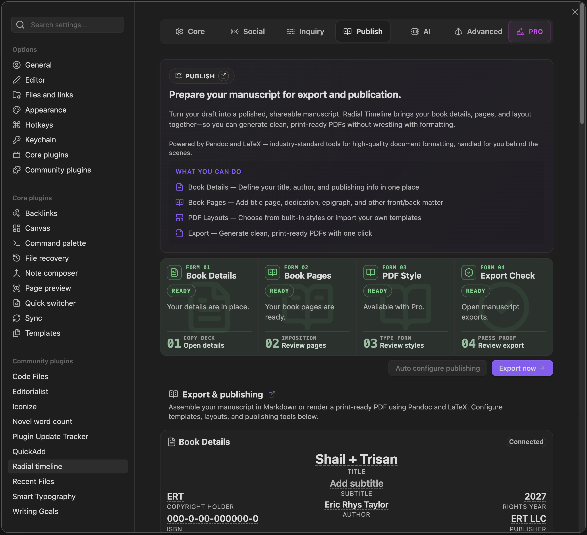

<div style="text-align: center; margin: 20px 0;">
  
  <div style="font-size: 0.85em; margin-top: 8px; color: #666;">Settings → Publish</div>
</div>

Radial Timeline turns your scene notes into a finished manuscript using **Pandoc** and **LaTeX**. You select a template that defines the look of the page — fonts, headers, chapter openers, part dividers — and the plugin assembles your scenes into that format and hands the result to Pandoc to produce a PDF.

**Pandoc-based PDF export ships with the plugin.** The Core surface exports PDFs with the bundled Core publishing layouts. **Pro** covers extra bundled PDF layouts and deeper publishing customization. See [Pro](Pro).

> **Prerequisites**: Pandoc installed (all Pandoc-based exports, including Word), plus LaTeX for PDF output. See below for the two-installer setup, and [Exporting a Manuscript](#exporting-a-manuscript) for the export workflow and checks.

---

## Installing Pandoc and LaTeX

Install Pandoc and a LaTeX distribution:

**macOS**
1. **Pandoc** — download the macOS `.pkg` installer from [pandoc.org/installing](https://pandoc.org/installing.html) and run it.
2. **LaTeX** — download **MacTeX** from [mactex.org](https://www.tug.org/mactex/) and run it. (Full MacTeX is large, ~5 GB; the ~100 MB **BasicTeX** package from the same page also works for exporting.)
3. In Obsidian: **Settings → Publish → Auto locate**. It checks common installation locations and updates the saved paths.

**Windows**
1. **Pandoc** — the Windows installer from [pandoc.org/installing](https://pandoc.org/installing.html).
2. **LaTeX** — [MiKTeX](https://miktex.org/download) (lets LaTeX fetch what it needs on first export).
3. **Settings → Publish → Auto locate**.

For Word (DOCX), install Pandoc and use **Auto locate** to configure its path.

*Alternative for terminal users:* Homebrew on macOS also works — `brew install pandoc` and `brew install --cask mactex-no-gui` — as does the standalone Pandoc binary in `~/.local/bin`. Auto locate probes all of these locations.

---

## Template Catalog

Bundled templates live in **Settings → Publish → PDF Styles**. Each row shows a status pill (**Installed** / **Not installed**), a preview card, and buttons for **Install** and **Duplicate**.

The Core surface includes the standard publishing layouts needed for Pandoc PDF export. Pro covers further advanced layouts and deeper publishing controls.

### Novel templates

| Template | Tier | Structure | Best for |
|---|---|---|---|
| **Basic** | Core | Standard double-spaced submission format | Sending to agents / editors |
| **Standard** | Core | Book-style with contemporary serif body, running headers, chapter openers | A finished book look with simple chapters |
| **Professional** | ✦ Pro | Literary book style with refined typography | Polished prose fiction |
| **Signature** | ✦ Pro | Full book structure — **Parts**, chapters, part epigraphs, ornament scene breaks | Novels with parts and chapters |

Narrative Mode shows **C** and **P** placards at author-placed `Chapter:` and `Part:` markers. The selected PDF layout determines how those markers print. See [Chapter and Part Placards](Narrative-Mode#chapter-and-part-placards).

<div style="text-align: center; margin: 20px 0;">
  
  <div style="font-size: 0.85em; margin-top: 8px; color: #666;">Narrative Mode perimeter markers — chapter starts, part boundaries, and combined Part/Chapter breaks</div>
</div>

PDF layouts use the fonts listed below. Installing PDF styles copies bundled fonts into `Radial Timeline/Pandoc/fonts/`; Basic uses system Arial.

| Template | Font |
|---|---|
| **Basic** | Arial (system font) |
| **Standard** | Source Serif 4 |
| **Professional** | Sorts Mill Goudy |
| **Signature** | Latin Modern Roman |

### Other formats

| Template | Tier | Format |
|---|---|---|
| **Screenplay** | ✦ Pro | Industry-standard screenplay |
| **Podcast Script** | ✦ Pro | Audio script with structured cues |

---

## Installing a Template

1. Open **Settings → Publish → PDF Styles**.
2. Find the template you want in the list. If the pill says **Not installed**, click **Install**.
3. The plugin copies the template's `.tex` file into `Radial Timeline/Pandoc/` inside your vault and installs bundled fonts into `Radial Timeline/Pandoc/fonts/`. The pill changes to **Installed**.

Only installed templates can be used for export.

## Core Surface and Pro Layouts

Settings → Publish is split around Core-surface and Pro publishing work:

*   **Core** includes Pandoc setup, output folders, Book Details, Book Pages, the **Basic** and **Standard** layouts, and Auto configure publishing.
*   **Pro** covers the **Professional**, **Signature**, **Screenplay**, and **Podcast Script** layouts and deeper designed publishing controls.

The export panel and **Settings → Publish** use the same template rules. If a Pro layout is selected and unavailable, Radial Timeline uses an available **Basic** layout for that format.

## Book Details and Matter Pages

**Auto configure publishing** is part of Core. It creates a Book Details note, optional inline LaTeX Book Pages examples, bundled PDF layout files, and required bundled fonts.

Fill in Book Details to generate title, copyright, dedication, epigraph, acknowledgments, author note, about the author, and other works pages directly.

Use a standalone LaTeX matter note only when you want a custom page body:

```yaml
---
Class: Frontmatter
BodyMode: latex
---
```

Example body:

```latex
\begin{center}
\vspace*{0.32\textheight}
\begin{minipage}{0.72\textwidth}
\itshape This optional front matter page is rendered as raw LaTeX.

\vspace{0.8em}
\raggedleft\normalfont --- Attribution
\end{minipage}
\vfill
\end{center}
\newpage
```

Inline LaTeX pages use the content in their matter notes.

Auto configure publishing refreshes exact retired starter examples while preserving edited author files. If a matter note no longer matches the old bundled starter content, Radial Timeline treats it as author-owned.

## Duplicating a Template

Every bundled template has a **Duplicate** button next to Install. Duplicating copies the `.tex` into your vault under a new name (e.g., `rt_modern_classic-copy.tex`), gives it a new display name ("Signature Copy"), and leaves the original untouched.

Use **Duplicate** to customize a copy of a bundled template. The copy shows the same preview card as the bundled template and accepts edits to its `.tex` file directly in your vault.

## The `Chapter:` Field

The `Chapter:` YAML frontmatter field is how you tell the exporter "this is where a new chapter starts."

Add it to the first scene note that belongs to each chapter:

```yaml
---
Class: Scene
Chapter: The Homecoming
---
```

Key behaviors:

- **Scene notes only.** Publishing reads `Chapter:` from exported scene notes.
- **First occurrence wins.** If five scenes share `Chapter: The Homecoming`, only the first one starts the chapter — the rest flow inside it.
- **Case-insensitive.** `Chapter`, `chapter`, `CHAPTER` all work.
- **Numbering is automatic.** You provide the title; the exporter supplies the number (`Chapter 1`, `Chapter 2`, …).

Mark the first scene of each chapter.

You can add or clear chapter markers from the scene right-click menu in Narrative mode, or edit the `Chapter:` field directly in the scene note.

---

## The `Part:` Field

Parts work exactly like chapters: a scene note carries a `Part:` field, and that scene opens the part.

```yaml
---
Class: Scene
Part: true            # numeral only — prints "I"
---
```

```yaml
---
Class: Scene
Part: The Crossing    # numeral and title
---
```

Set `Part: true` when you want the numeral alone, which is what most books do. Give it a string when the part has a name.

Key behaviors:

- **Scene notes only**, same as `Chapter:`.
- **Numbering is automatic and sequential.** The first marked scene is Part I, the second Part II, and so on.
- **Case-insensitive.** `Part`, `part`, `PART` all work.
- **Clear a part** from the right-click menu to remove its marker.

Mark the first scene of each part. Scenes before the first marker can form a prologue.

**Ordering**: Part → Chapter → Scene. A scene can open both a part and a chapter.

Add or clear part markers from the scene right-click menu in Narrative mode (**Set part…**), or edit the field directly in the scene note.

> `Act:` places a scene in a timeline act; `Part:` starts a publishing part. Choose each structure to suit your book.

**Signature** prints Part divider pages. Check the Part preview card for the behavior of a custom layout.

---

## Part Epigraphs

A Part page can carry a quote and an attribution. Set them in the active book’s layout options.

**Settings → Publish → (your layout) → Part epigraphs**

Entries pair with markers **by position**: the first entry prints on Part I, the second on Part II, and so on.

Because the pairing is positional, the two sides have to agree. The export checks report both directions:

- **Fewer epigraphs than marked parts** — some parts will print without one.
- **More epigraphs than marked parts** — add the intended Part markers or remove surplus epigraph entries.

Both appear on the PART preview card in the Publish panel and in the export checks before you generate a PDF.

---

## Setting Up Signature

> [!NOTE]
> Signature is a **✦ Pro** layout. If it is unavailable, exporting falls back to Basic.

Signature is the most structured bundled template. It produces a book-style manuscript with:

- **Part openers** on their own page (with Roman numerals: I, II, III)
- **Optional part epigraphs** — a quote + attribution printed after each Part page
- **Numbered chapter openers** from your `Chapter:` fields
- **Ornament scene breaks** — scenes within each chapter flow as prose separated by a centered ornament

Here's the full setup, step by step.

### Step 1 — Install Signature

**Settings → Publish → PDF Styles → Signature → Install**

The template file writes to `Radial Timeline/Pandoc/rt_modern_classic.tex` in your vault.

### Step 2 — Mark your parts

Right-click the scene that opens each part in Narrative mode and choose **Set part…**, or add the field directly:

```yaml
Part: true            # numeral only
Part: The Crossing    # numeral and title
```

Parts are optional. Each `Part:` marker starts a numbered part, beginning with Part I.

### Step 3 — Add part epigraphs (optional)

**Settings → Publish → Signature → Part epigraphs**

Entries pair with your markers by position. If the counts disagree in either direction, the Publish panel and the export checks say so before you generate a PDF.

See [Scene Properties](YAML-Frontmatter) for the full frontmatter schema.

### Step 4 — Add `Chapter:` markers

Decide where each chapter should begin. On the first scene of each chapter, add:

```yaml
Chapter: The Gathering Storm
```

Choose chapter titles and boundaries that fit your book.

### Step 5 — Assign Signature to the Novel format

Open the export panel (Command Palette → **Manuscript export**). In the template dropdown for Novel, choose **Signature**. The plugin remembers your last selection for next time.

### Step 6 — Export

Command Palette → **Manuscript export** → choose your options → **Export**.

The exporter:
1. Walks the timeline in narrative order.
2. Emits a **Part** divider at each `Part:` marker, with the matching epigraph when supplied.
3. Emits a **Chapter** opener every time a new `Chapter:` value appears.
4. Emits scene prose separated by ornaments inside each chapter.
5. Hands the assembled markdown to Pandoc, which produces a PDF.

Output goes to `Radial Timeline/Export/` by default. You can change the destination in **Settings → Advanced → Configuration → Export folder** — type or pick any folder inside your vault, and the chip beside the field reveals it in Obsidian's file explorer. Because exports are written through the vault, the folder must live inside the vault; to keep exports on an external drive (for example a Google Drive folder), point a sync/symlink at your chosen Export folder, or copy the generated files out after exporting.

### Minimum viable Signature manuscript

The smallest setup that produces a valid Signature PDF:

- Signature **Installed**
- At least one scene (anywhere) with a `Chapter:` value

Add Part markers and epigraphs as your book requires. Pandoc, LaTeX, and the layout’s fonts must also pass export checks.

---

## Scene Opener Heading Options

Templates that have the **Scene opener heading options** capability let you choose how scene titles appear at the start of each scene. Available modes:

- **Scene number** — just the number (`3` or `Scene 3`)
- **Scene number + title** — `3 — Opening Beat` (default)
- **Title only** — `Opening Beat` (no number)

Find this in **Settings → Publish → PDF Styles → [template] → +** (expand) → **Scene openers**.

**Signature** separates scenes with ornaments. Use Basic, Standard, or Professional for labeled scene openers.

---

## Exporting a Manuscript

**Command Palette → Manuscript export**

The export panel lets you:
- Select the output format (Novel, Screenplay, Podcast Script)
- Choose the template for that format
- Select which scenes to include (all, or filtered by act/subplot)
- Choose Markdown, PDF, or Word (DOCX) output
- Review export checks for missing templates, missing fonts, template compatibility, and layout-specific warnings
- Preview the selected layout's page structure before generating a PDF

Files land in `Radial Timeline/Export/` by default, or in whatever vault folder you set under **Settings → Advanced → Configuration → Export folder**.

For the end-to-end export workflow and troubleshooting, start here and use the checks in the export panel to catch missing Pandoc, LaTeX, templates, or fonts before rendering.

---

## What Survives Export — the Content Contract

If you're migrating a manuscript that already carries Pandoc/LaTeX markup, this is the exact contract the exporter honors:

**Preserved verbatim (PDF export):**
- Inline LaTeX commands in scene text — `\newpage`, `\vspace{…}`, custom macros. Scene bodies reach Pandoc as written and render as LaTeX.
- Raw LaTeX environments (`\begin{…}…\end{…}`), fenced code blocks, and display math (`$$…$$`) — preserved through export cleanup, including comment, link, and task-marker patterns inside them.

**Always removed:**
- YAML blocks (`---…---` with `key: value` lines) anywhere in the compiled text — including note frontmatter. Keep manuscript prose outside YAML fences.
- Editorialist review blocks.

**Removed only when the matching cleanup toggle is on:** `%%comments%%`, `%%ai: queries%%`, HTML comments, links (label kept), callouts, block IDs, and (PDF/Word) task-list markers.

**Document metadata:** `title` and `author` always come from your BookMeta note. A YAML metadata block at the top of your old manuscript is *not* forwarded — use **Settings → Publish → Advanced Pandoc** (Pro) instead:
- **Custom Pandoc metadata** — extra `--metadata key: value` pairs for custom/imported templates (`lang`, `subtitle`, or any variable your template reads).
- **Custom LaTeX preamble** — raw LaTeX injected into the PDF preamble after the layout's own setup, so your `\usepackage`/`\newcommand` definitions win. This is the escape hatch for reproducing an existing Pandoc setup exactly.

**Word (DOCX) export** converts the same compiled Markdown via Pandoc using a bundled reference document (standard manuscript format). LaTeX commands are not rendered in DOCX output — they pass through Pandoc's raw-LaTeX handling and are dropped from the Word file, so keep LaTeX-dependent formatting on the PDF path.

---

## Troubleshooting

**Template shows "Not installed" after I clicked Install.** The `.tex` file couldn't be written — check that `Radial Timeline/Pandoc/` exists and is writable.

**Parts don't appear in my Signature export.** Parts emit where a scene carries a `Part:` field. Check that at least one exported scene has one, and that the value is not empty — an empty `Part:` is not a marker. If you are exporting a scene range, check a marked scene falls inside it.

**I set a part but no badge appears on the timeline.** Turn on **Settings → Advanced → Configuration → Show part and chapter markers**. The markers are saved either way; that toggle only controls whether the ring displays them.

**Chapter numbering is wrong.** The exporter numbers chapters by the order `Chapter:` values appear in the timeline. If a `Chapter:` value appears out of order, renumbering will reflect that. Check narrative order via [Timeline Modes](Radial-Timeline-View#modes-at-a-glance).

**Duplicated template looks different from the original.** If you're on an older plugin build, duplicates lost their preview card due to a bug. Update to the latest build — duplicates now render with the same preview card as the original and can be edited in place.

**Epigraph fields are greyed out.** Epigraphs are per-book. Make sure you have an **active book** selected before editing them.

**Export checks say a bundled font is missing.** Click **Install fonts** or **Install all** in Settings → Publish. Export checks identify the exact font each layout needs.
