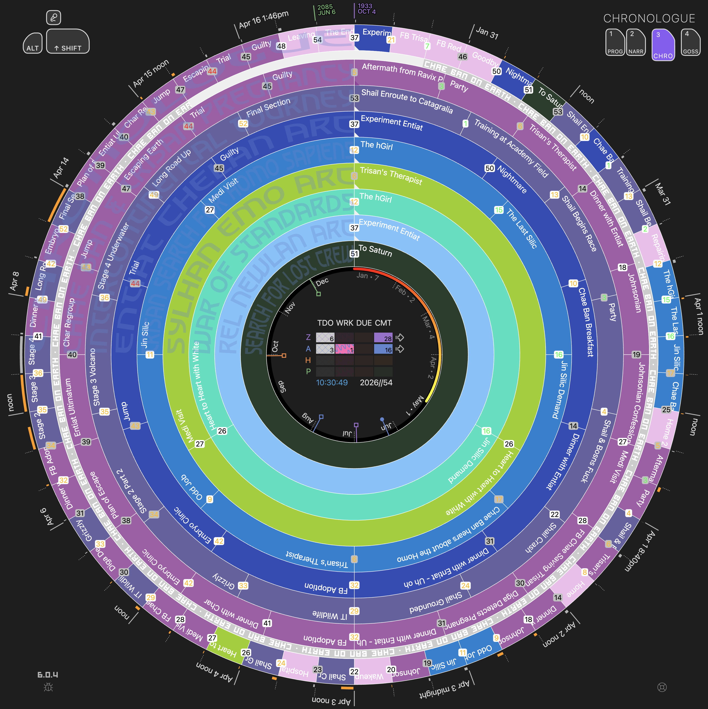
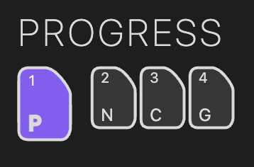
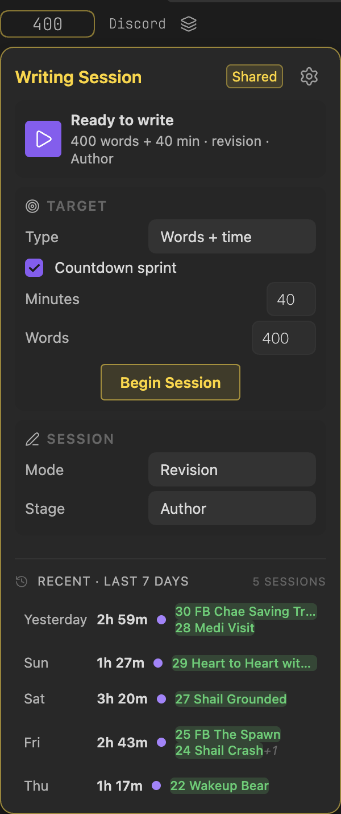
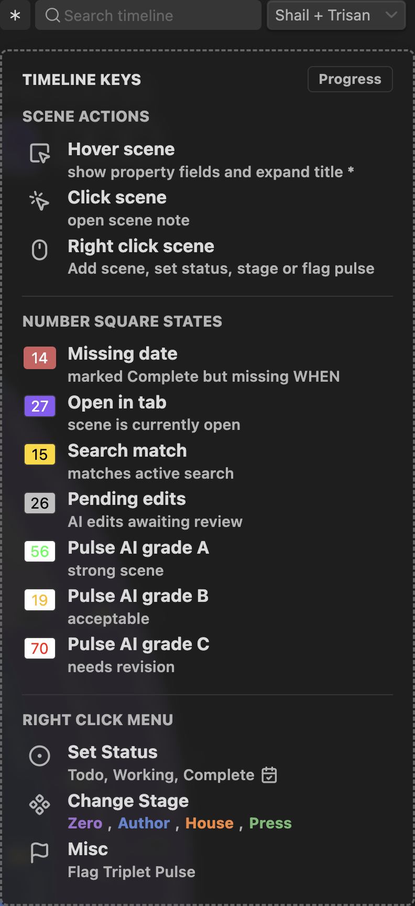

  
  
Radial Timeline View — shown in Chronologue mode

The Radial Timeline View is the main authoring and analysis workspace in Radial Timeline. It is where you work directly with scenes, subplots, chronology, beats, and scene-level AI feedback.

**Open**: Command palette → **`Radial timeline: Open`**, or click the RT logo icon in the ribbon.

## Overview

A radial manuscript workspace with four modes:

| Mode | Key | Focus |
| :--- | :--- | :--- |
| **[Progress](Progress-Mode)** | `1` | Writing status and revision stages |
| **[Narrative](Narrative-Mode)** | `2` | Manuscript order and subplot structure |
| **[Chronologue](Chronologue-Mode)** | `3` | Story-world chronology and duration |
| **[Gossamer](Gossamer-Mode)** | `4` | Beat-level scoring and comparison |

  
  
Mode buttons — Progress, Narrative, Chronologue, and Gossamer

## What You Can Do

*   write, add, or reorganize scenes
*   switch between books or view an entire Saga from the title-bar book selector
*   open a writing session from the title-bar count/session button
*   use the timeline legend to read scene actions and mode-specific controls
*   compare subplot balance and structure
*   check chronology and elapsed time
*   score beats and compare Gossamer traces
*   review scene-level AI feedback via [AI Pulse Triplet Analysis](AI-Pulse-Analysis)

## Modes At A Glance

### Progress Mode (`1`)
Gives every subplot its own radial ring — no combined outer ring — with the main plot emphasized and other subplots muted. Scenes inherit the author workflow palette (Todo solid pink, Working pink plaid, Overdue red, Complete = progress-stage color) along with progress-stage indicators. Removes story beats for a cleaner view. Structured around your configured **act count** (default 3) with acts spanning equal segments of the 360° circle. Emphasizes **Author time** (writing status) and **Progress stages** (revision stages).

### Narrative Mode (`2`)
Shows all scenes from all subplots on the outer ring with story beats and subplot color-coding. Structured around your configured **act count** (default 3) with scenes organized by act divisions (360° divided evenly across acts). Your primary manuscript-order workspace showing **Narrative time** (reading order). Status/progress overlays are hidden so subplot colors remain dominant.

**Interactive reordering**: drag scenes on the outer ring. See [Reorder Scenes](How-to#reorder-scenes).

**Tip**: For scenes in more than one subplot, click on a scene to make that subplot dominant in the outer ring color. The folded-corner motif at the start of each subplot ring shows the state: missing (not assigned), gray (assigned but not dominant), or a darker hue of the subplot color (dominant and expressed on the outer ring).

See [Narrative Mode](Narrative-Mode) for Saga scope, chapter/part placards, and dominant subplot behavior.

### Chronologue Mode (`3`)
Displays scenes in chronological story order based on `When`. **Removes act divisions** entirely — scenes are positioned across the full 360° circle based solely on when they occur in your story's timeline. Color styling mirrors Narrative mode (subplot colors only) to keep time comparisons clean.

Three sub-modes for deeper temporal analysis:

*   **Shift** (press `Shift`, use `Caps Lock`, or click the button) — gray wireframe revealing the chronological backbone. Click scenes to measure elapsed time and spot discontinuity gaps.
*   **Alt** (press `Alt`) — planetary wireframe overlay translating Earth dates into your active local time profile.
*   **Runtime** ✦ Pro (click the `RT` button) — blue wireframe showing scene runtime duration arcs instead of elapsed story time.

Additional features: discontinuities marked with ∞ and smart duration labels.

### Gossamer Mode (`4`)
Visualizes beat-level scoring across your active story beat system. Supports **Momentum**, **Tension**, **Activity**, and **Interiority**, with saved run history and a top-left plots panel for switching signals and comparing runs.

## Book Selector

The tab title bar includes a book selector. Choose an individual Book Manager profile to focus the timeline on one manuscript, or choose **Saga** to view all configured books together in Narrative Mode.

  
  
Tab title bar actions — book selector, mode controls, and quick view actions

See [Narrative Mode](Narrative-Mode#book-and-saga-scope) for Saga behavior and limits.

## Bug Reports

The title bar bug icon opens the built-in bug report workflow. You can describe the issue, capture or attach a screenshot, paste an image from the clipboard, and send the report to GitHub. If you do not have a GitHub account, use the email fallback from the same modal.

## Writing Session Control

The title bar also includes the compact count/session button used for Sessions.

*   Click it to open the **Writing Session** panel.
*   Start an open-ended session or a countdown sprint.
*   Pause, resume, save, stop, or discard the current session from the panel.
*   Use the settings icon in that panel to jump straight to **Settings → Core → Sessions**.

  
  
Writing Session panel — timer, daily goal context, and session controls

## Discord Presence Chip

A small chip sits in the title bar, to the right of the writing-session count/session control. It links to the Radial Timeline Discord community.

*   **Green ("Discord · online")** means presence has been confirmed recently — the community is actively staffed right now.
*   **Muted ("Discord")** means either no one is confirmed present, or the chip's last successful check is stale. A failed network check always reads as muted, never green — the chip can only ever go quiet, never falsely light up.
*   Clicking the chip opens the Discord invite.

The chip polls a public status endpoint roughly every 60 seconds by default, for every user. **It is shown to everyone and is not gated on connecting to Community** — the Discord server is open to all Radial Timeline users regardless of whether you use Community Share. See [External Services & Network Access](https://github.com/EricRhysTaylor/Radial-Timeline#external-services--network-access) in the README for the network-access disclosure.

## Timeline Legend

The legend is a quick visual guide for the current mode.

*   It explains basic scene actions such as **Hover**, **Click**, and **Right click**.
*   It includes mode-specific help for **Narrative**, **Progress**, and **Chronologue**.
*   The right-click guidance now includes **Add scene** alongside status, stage, and Pulse actions.

  
  
Timeline legend — scene actions and mode-specific controls

## Mode Controls

The mode buttons in the title bar switch between the four main views:

*   **Progress**
*   **Narrative**
*   **Chronologue**
*   **Gossamer**

  
  
Mode buttons — Progress, Narrative, Chronologue, and Gossamer

