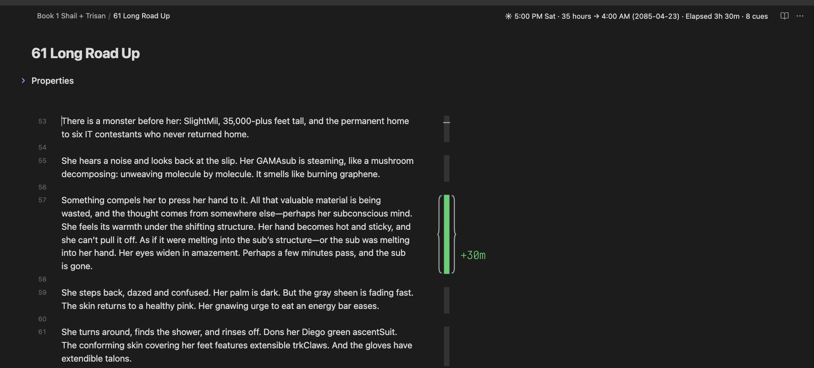
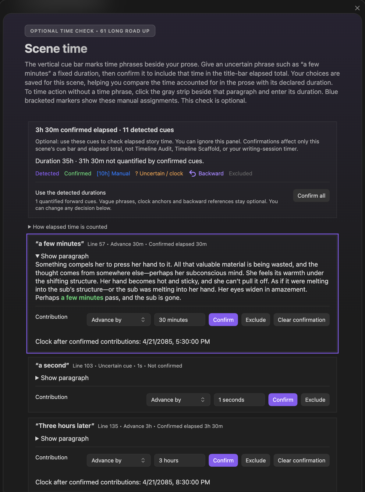

# Scene Time

Scene Time helps you check how much story time passes inside a scene. It reads the time phrases in your prose, such as "three hours later" or "a few minutes", and marks them beside the text. You decide which ones count. The running total appears in the note's title bar, next to the scene's `When` and `Duration`.

Scene Time is optional. It never changes your prose or your scene properties.

  
  
The title bar shows when the scene starts and how much time is accounted for. The bar beside the prose marks each time phrase.

## The title bar

Every Scene note shows a short time summary in its title bar. For example:

`5:00 PM Sat · 35 hours → 4:00 AM (2085-04-23) · Elapsed 3h 30m · 8 cues`

*   **5:00 PM Sat**: the start time and day of the week, from the scene's `When` date.
*   **35 hours → 4:00 AM (2085-04-23)**: the scene's `Duration`, and when the scene ends.
*   **Elapsed 3h 30m**: the story time you have confirmed so far.
*   **8 cues**: time phrases you have not reviewed yet.

If the confirmed time runs longer than the scene's `Duration`, or an **Elapsed since start** entry would move the clock backward, the summary adds **Review timing**.

Click the summary to open the Scene Time panel.

## The cue bar

A thin bar runs beside your prose, in both editing and Reading view. Each time phrase gets a colored strip beside its paragraph:

*   **Purple**: a time phrase Radial Timeline found.
*   **Green**: a time phrase you confirmed. Its label shows the time it adds, such as `+30m`.
*   **Blue, in brackets**: time you entered yourself for a paragraph with no time phrase, such as `[10h]`.
*   **Orange with a `?`**: a vague phrase ("a few minutes") or a clock time ("3 am") that needs your judgment.
*   **Backward arrow**: a phrase that looks back in time ("two days earlier"). It never adds time.
*   **Gray**: a phrase you excluded.

Hover a strip to see a bracket around the paragraph it belongs to. Click it to review that phrase in the Scene Time panel.

Written-out numbers are read in full. "Thirty-one days" counts as 31 days, and "forty-five minutes" as 45 minutes.

## Checking elapsed time

  
  
The Scene Time panel: each time phrase with its paragraph, what it adds, and the story clock after it.

The panel lists every time phrase in the scene. For each one, choose what it means and confirm it:

*   **Advance by**: the story moves forward by this much. Give vague phrases a fixed amount, such as "a few minutes" = 30 minutes.
*   **Elapsed since start**: this much time has passed since the scene began. It resets the running total instead of adding to it.
*   **Exclude**: the phrase does not move the story forward. Use this for dialogue, plans, memories, or events happening elsewhere.

**Confirm all** accepts every phrase with a clear amount, such as "three hours later", in one step. Vague phrases, clock times, and backward references always wait for you.

After each confirmed phrase, the panel shows the story clock at that point, so you can see the scene's timeline unfold.

Not every stretch of prose needs a time phrase. Time that no phrase accounts for is not necessarily missing.

## Timing a paragraph without a time phrase

Some action takes time even when the prose never says so, like a long climb or a night of travel. To give it a duration:

1.  Click the gray strip beside the paragraph.
2.  Enter how long the action takes, such as "10 hours".

A blue bracketed marker appears beside the paragraph, and the time counts toward the title-bar total. You can also select a line of prose and run the command **Assign scene time to selection**.

## Turning the cue bar off

Go to **Settings → Advanced → Timeline Display** and turn off **Show scene time cue bar**. The title-bar summary stays visible. See [Advanced settings](Settings-Advanced).

## What Scene Time changes

Scene Time only affects the cue bar and the elapsed total in the title bar. It does not change Timeline Audit, Timeline Scaffold, or your writing-session timer.

Your decisions are saved per scene in the `Radial Timeline/Scene Time` folder of your vault. Your notes and their properties are never edited. If you rewrite a paragraph, review its time phrase again.
