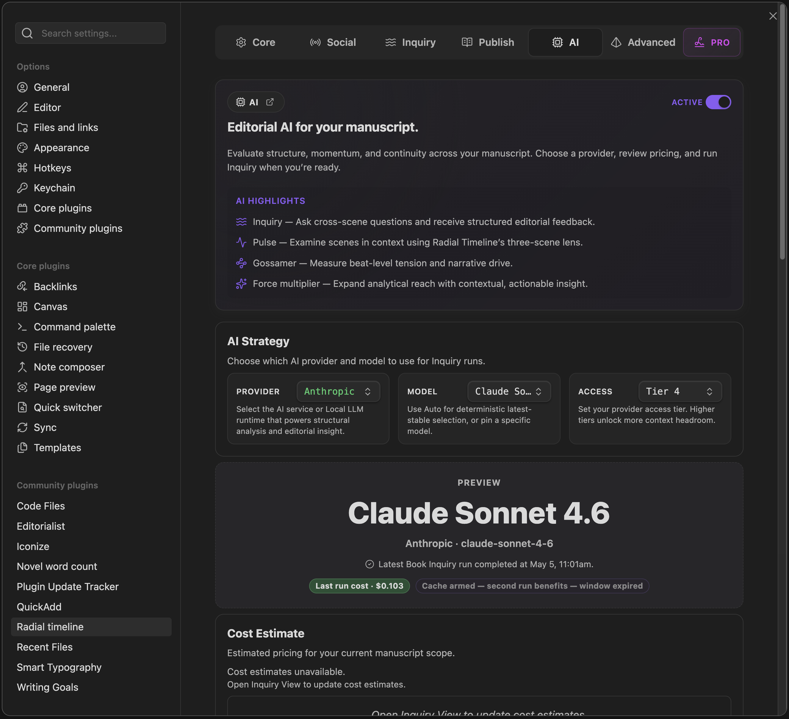

  
  
Settings → AI

The AI tab controls provider setup, model selection, prompt framing, cost awareness, and the defaults used by Inquiry, Pulse, Gossamer, and Summary Refresh.

## AI Toggle

*   **Enable AI LLM features**: Turns AI-driven commands and scene-analysis UI on or off. Disabling AI hides those surfaces but does not delete existing note properties.

> **Default: off.** New installs are AI-free until you enable this toggle. Existing vaults keep the setting you already chose — upgrading never flips it for you.

## AI Strategy

This is the main routing section for cloud and local AI.

*   **Provider**: Choose **Anthropic**, **OpenAI**, **Google**, or **Local LLM**.
*   **Model**: Leave it on the latest stable lane or pin a specific model.
*   **Access**: Set the tier that your provider account has granted you. These tiers are applied for and approved by the provider, then reflected here for context limits and capability headroom.
*   **Cost Estimate**: Shows estimated Inquiry pricing for your current manuscript scope.
*   **What gets sent to the AI**: Breakdown cards for Inquiry and Gossamer so you can see the rough corpus, prompt, output, and processing footprint.

## Role Context

*   **AI prompt role & context template**: Controls the shared editorial framing used across AI features.
*   **Manage context templates**: Use the gear button to edit templates and switch the active one.

## API Keys

Provider API keys are configured here.

*   Keys are validated against the selected provider.
*   Saved keys show a live status such as **Ready**, **Not configured**, **Key rejected**, or **Provider validation failed**.
*   When supported by the current Obsidian build, Radial Timeline uses secure key storage instead of plain-text settings fields.

## Configuration

These settings control AI feature defaults rather than provider identity.

### Inquiry

*   **Enable citations (temporarily unavailable)**: Strict provider-level inline citations are still paused.
*   Inquiry currently uses a looser partial-citation path instead, centered on per-finding evidence quotes and Sources blocks in the result view.

### Timeline Display

*   **Pulse context**: Include previous and next scene analysis in the scene hover reveal.
*   **Synopsis max words**: Base target for stored Synopsis generation.

### Summary Refresh Defaults

*   **Target summary length**: Default word target when opening Summary Refresh.
*   **Treat summary as weak if under**: Default threshold for selecting scenes as weak/stale in the Inquiry View Corpus model.
*   **Also update Synopsis**: When enabled, Summary Refresh also rewrites `Synopsis` using the configured cap.

> [!NOTE]
> AI diagnostics logging lives on the Advanced tab as **Enable AI content logs** — see [Settings → Advanced](Settings-Advanced).

---

## Local LLM

Choose **Provider → Local LLM** to run AI analysis entirely against a runtime on your own machine — Ollama, LM Studio, or another OpenAI-compatible server. This is a fully supported provider, not a fallback option: it has its own backend registry, capability inference, structured-JSON handling, transport layer, and diagnostics runner behind it, the same as the hosted providers. Choose it when you want zero-cost, fully private analysis and are willing to pick a model with enough capability for the features you use.

### Local LLM Configuration

*   **Local server**: Select the runtime behind the Local LLM path — **Ollama**, **LM Studio**, or a generic **OpenAI-Compatible** server.
*   **Base URL**: Endpoint for the selected server. Defaults differ per runtime — see the setup blocks below.
*   **Manual model ID (fallback)**: Only use this when automatic model discovery cannot find the model you want.

### Local LLM Status And Validation

This section is the health check for local AI.

*   **Load Servers**: Detect available local runtimes.
*   **Load Models**: Query the selected runtime for installed models.
*   **Validate Local LLM**: Run connection and capability checks.
*   The status area reports connection, model availability, validation state, and rough capability strength.

### Setting Up Ollama

1. Install and run [Ollama](https://ollama.com) on the same machine as Obsidian (or a machine reachable from it).
2. Pull a model with Ollama's own tooling, then select **Ollama** as the local server.
3. **Base URL** defaults to `http://localhost:11434/v1`. Leave it as-is for a local install; change the host if Ollama runs elsewhere on your network.
4. Use **Load Models** to confirm Radial Timeline can see your pulled models, then **Validate Local LLM**.

### Setting Up LM Studio

1. Install [LM Studio](https://lmstudio.ai) and download a model inside it.
2. Start LM Studio's local server (its own UI has a server toggle), then select **LM Studio** as the local server in Radial Timeline.
3. **Base URL** defaults to `http://localhost:1234/v1`.
4. Use **Load Models** to confirm the loaded model is visible, then **Validate Local LLM**.

### Local LLM Troubleshooting

**Validate Local LLM** runs a sequence of checks — each can fail independently, and the message tells you which one to fix first.

| Check | What it means | How to fix |
| :--- | :--- | :--- |
| Server unreachable | Radial Timeline could not reach the **Base URL** at all. | Confirm the runtime is running, the port matches (Ollama `11434`, LM Studio `1234`), and no firewall/VPN is blocking localhost traffic. |
| Model not loaded | The server responded, but the model you selected isn't among the models it reports. | In Ollama, pull the model; in LM Studio, load it in the app. Then re-run **Load Models**. |
| No structured-output support | The server returned text, but Radial Timeline could not get clean structured JSON out of it — required for Pulse, Gossamer, and Inquiry to parse results. | Try a different, more capable model. Some small or heavily quantized models cannot reliably follow structured-output instructions. |
| Context too small | The model's context window or output limit is too small for the prompt Radial Timeline needs to send (this shows up as a low capability tier, or as a timeout on basic/structured completion checks). | Choose a model with a larger context window, or reserve Local LLM for lighter tasks (Summary, single-scene work) and use a hosted provider for larger corpus features. |

### Why Pulse Is Strict For Local LLM

Pulse is more demanding than a simple one-shot text task.

It sends the **previous**, **current**, and **next** scenes together, then expects clean structured output that Radial Timeline can parse into scene hover properties. That means whichever model you run — local or hosted — has to do both of these reliably:

*   handle a larger three-scene prompt without falling apart
*   return stable structured output instead of chatty or malformed output

This is a model-capability question, not a Local LLM-versus-hosted question: a small or lightly-quantized local model can struggle with Pulse the same way a weak hosted model would. Pick a local model sized for the feature you want — see the capability tier and feature-support readout after **Validate Local LLM**.

### Recommended Use

*   Use **Local LLM** for zero-cost, fully private analysis — pick a model with enough capability headroom for the features you use, and validate it after selecting it.
*   Use **Anthropic**, **OpenAI**, or **Google** when you want managed model selection and the broadest tested coverage across Pulse, Gossamer, and Inquiry without having to size a local model yourself.
