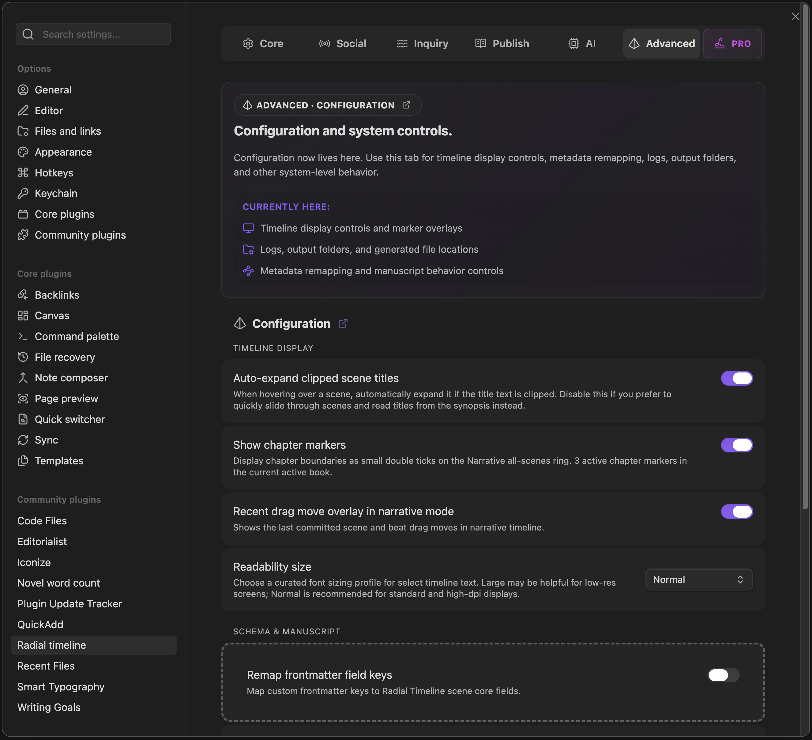

  
  
Settings → Advanced

The Advanced tab holds lower-level system and workflow controls.

## Configuration

Advanced is currently grouped into three areas:

### Timeline Display

*   **Auto-expand clipped scene titles**: Automatically expands truncated scene titles on hover.
*   **Show part and chapter markers**: Displays part and chapter boundaries on the Narrative all-scenes ring and reports how many active chapter markers exist in the current book.
*   **Recent drag move overlay in narrative mode**: Shows the last committed scene and beat drag moves.
*   **Readability size**: Switches curated timeline text sizing between `Normal` and `Large`.
*   **Show scene time cue bar**: Shows time-phrase markers beside Scene notes in editing and Reading view. Turn it off to hide the bar; the time summary in the note's title bar stays visible. See [Scene Time](Scene-Time).
*   **Show Community mailbox**: On a vault connected to the Community, shows the **Mailbox** button beside the writing-session control that marks new replies to your requests and questions. On by default. Turning it off also stops its hourly check. See [Radial Timeline View](Radial-Timeline-View#community-mailbox).
*   **Show Desk Lamps**: On a vault connected to the Community, shows the lamp beside the Mailbox with your Desk Lamps at their desks, and lets the session panel share a session with them. On by default. Turning it off hides both and keeps your own lamp off. See [Desk Lamps](Desk-Lamps).

### Schema & Manuscript

*   **Remap frontmatter field keys**: Map custom frontmatter keys to Radial Timeline scene core fields.
*   **Manuscript ripple rename**: Normalizes scene and active-beat filename prefixes after drag reorder. Scenes stay integer-numbered; beats use decimal minors.

### Logs

*   **Logs**: Readout of the main RT logs location.
*   **Export folder**: Destination for manuscript, outline, and cue-card exports. Editable — type or pick any folder inside your vault; the chip beside the field reveals it in the file explorer.
*   **Enable AI content logs**: When enabled, full prompts, materials, and API responses are written as content logs.
