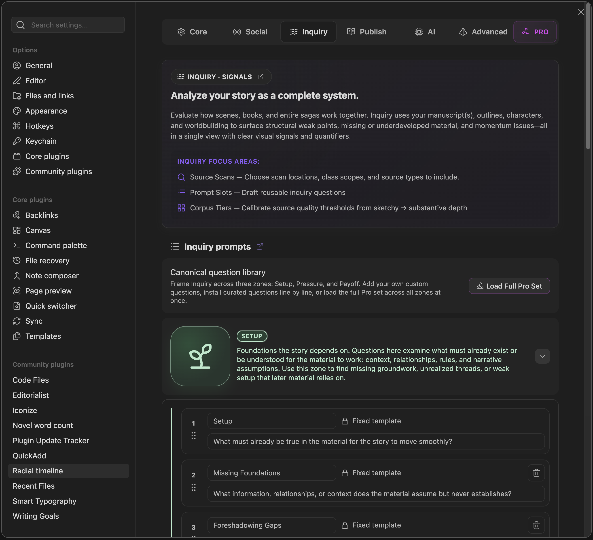

  
  
Settings → Inquiry

The Inquiry tab controls how Inquiry scans your vault, manages prompts, tunes corpus thresholds, and writes action notes.

For the operating guide to the Inquiry View itself, see [Inquiry](Inquiry).

## Inquiry Prompts

*   **Default prompts**: Built-in prompt slots for Setup, Pressure, and Payoff zones.
*   **Custom questions**: Add and reorder custom prompts per zone. Free plans include 3 custom questions per zone; Pro raises the limit to 8.

> [!NOTE]
> The behavior of these prompts in the live view is documented in [Inquiry](Inquiry#prompts).

## Inquiry Sources

*   **Books for Inquiry**: Choose which book profiles Inquiry scans. Use **Open Book Manager** to edit the profiles themselves.
*   **Material rules**: Class table controlling which YAML classes are scanned and whether each applies to the **Book**, **Saga**, and/or **Reference** scope.
*   **Supporting material folders**: Add support-material vault paths beyond the book folders. Supports wildcards and `/` for vault root.
*   **Presets**: **Default**, **Light**, and **Deep** apply preconfigured source selections.

### How Inquiry Identifies Books

Inquiry uses the book profiles you configure in **Settings -> Core -> Books**.

Each book profile contributes one book folder to Inquiry. In **Book** scope, Inquiry uses the active book profile. In **Saga** scope, it can scan across the included book profiles together.

**Supporting material folders** are separate. They add support material and other configured vault paths, but they are not the main way books are defined.

## Corpus (CC)

*   **Thresholds**: Tune the word-count tiers (`Empty`, `Sketchy`, `Medium`, `Substantive`) used in Corpus cards. Counts are content-only (frontmatter excluded). A reset control restores the defaults.

Low-substance notes (those still in the `Empty` or `Sketchy` tiers) are marked automatically in the Corpus view — this is built-in behavior, not a setting.

> [!NOTE]
> See [Corpus & Material Modes](Inquiry#corpus-material-modes) for how Inquiry uses these settings in actual runs.

## Configuration

*   **Auto-populate Pending Edits**: Automatically write Inquiry action notes to the `Pending Edits` YAML field on hit scenes after each run. The target field is fixed to `Pending Edits`.
